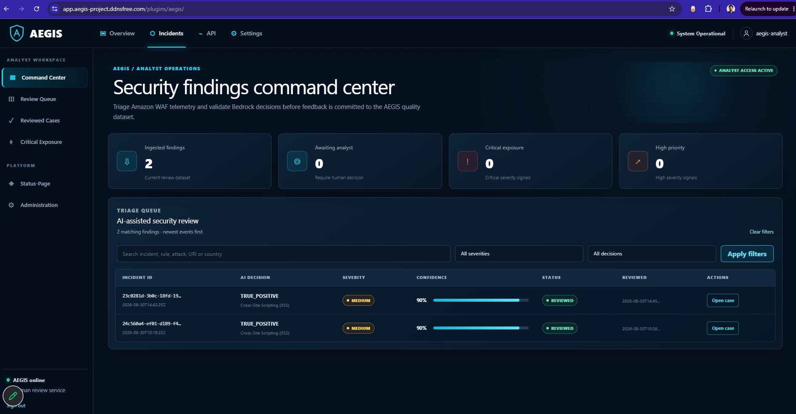
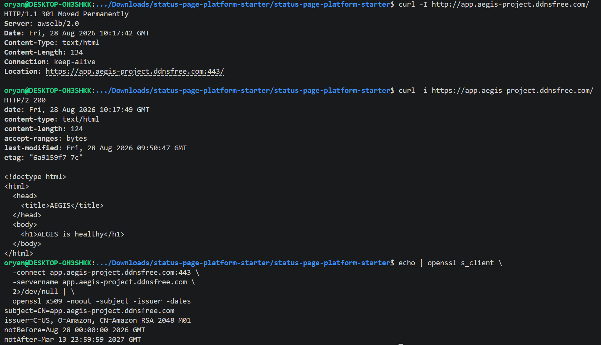
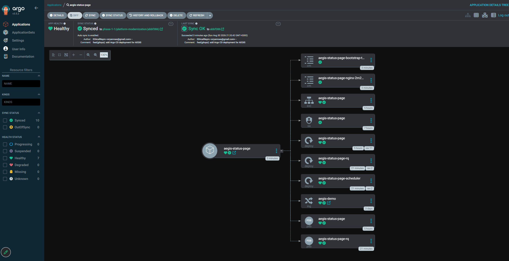

<div align="center">

# AEGIS

### AI-assisted cloud security operations on AWS — governed by humans, hardened on Kubernetes, and delivered through GitOps

AEGIS turns AWS edge telemetry into structured, reviewable security findings while operating a production-style workload on Amazon EKS.

[](https://github.com/EthicalNayro/AEGIS/actions/workflows/status-page-ci.yml)
[](https://github.com/EthicalNayro/AEGIS/actions/workflows/aegis-ci.yml)
[](https://github.com/EthicalNayro/AEGIS/actions/workflows/terraform-ci.yml)


[Showcase endpoint](https://app.aegis-project.ddnsfree.com) · [Architecture](docs/architecture.md) · [Final acceptance](docs/final-acceptance.md) · [Evidence](docs/evidence.md) · [Diagram set](docs/diagrams/README.md)

</div>

> [!IMPORTANT]
> **AEGIS does not perform autonomous remediation.** Amazon Bedrock produces advisory findings; an authenticated staff analyst makes the final decision. AI output is treated as untrusted data and never receives infrastructure mutation authority.

> [!NOTE]
> The accepted showcase state passed a reproducible **12/12 final technical gate** covering repository hygiene, Terraform validation, GitOps rendering, Argo health, application and ExternalDNS rollouts, DNS safety mode, least-privilege RBAC, immutable digest consistency, multi-AZ placement, and public HTTPS health.

## What AEGIS demonstrates

AEGIS is a portfolio-scale DevSecOps and cloud-security platform built as one connected system rather than a collection of isolated demos.

| Plane | Implemented in AEGIS |
|---|---|
| **Runtime** | Private Amazon EKS workers, multi-AZ Status-Page replicas, health probes, topology spread, Pod Disruption Budgets, Karpenter recovery, RDS PostgreSQL, and ElastiCache Redis |
| **Security operations** | AWS WAF telemetry, CloudWatch alarms, EventBridge, SQS/DLQ, a Pod Identity-backed analyzer, Amazon Bedrock, validated structured output, DynamoDB findings, and conditional human review |
| **Secure delivery** | GitHub OIDC, pinned third-party Actions, container validation, Trivy gates, CycloneDX SBOM, immutable ECR digests, guarded GitOps updates, and Argo CD reconciliation |
| **Observability** | Prometheus, Grafana, kube-state-metrics, protected node telemetry, CloudWatch edge/security signals, Argo health, and a custom **AEGIS Platform Health** dashboard |

The validated showcase environment is `eks-dev` in `us-east-1`. The public application path is available through `https://app.aegis-project.ddnsfree.com` while the demonstration environment is active; security operations remain staff-only.

## Analyst experience



<p align="center"><sub>AEGIS over public HTTPS: KPI-driven triage, severity and review-state filters, confidence visualization, and direct case access.</sub></p>

The isolated Status-Page AEGIS plugin provides:

- a responsive security command center with operational KPIs;
- searchable findings with severity, confidence, and review-state signals;
- an incident view that separates AI assessment from raw WAF evidence;
- one-time `CORRECT` / `INCORRECT` analyst verdicts with optional correction and notes;
- conditional DynamoDB updates that prevent accidental double review;
- accessible loading, empty, error, focus, and responsive states;
- a staff-protected observability workspace with embedded Grafana dashboards.

The plugin lives under `status-page/statuspage/aegis_review/`; the upstream Status-Page application is kept intentionally isolated from the AEGIS security-operations presentation layer.

## Architecture at a glance

### Final platform architecture


The accepted topology separates the public edge, private EKS runtime, managed data services, security/AI services, GitOps control plane, and deliberate DNS automation boundary.

### Security signal → AI analysis → human decision


A blocked-request signal is routed through CloudWatch, EventBridge and SQS, enriched by the analyzer, classified by Bedrock, validated before persistence, and finalized only through protected staff review.

### Secure CI/CD & GitOps


CI validates and publishes an immutable artifact; Git declares the desired digest; Argo CD owns cluster reconciliation. The GitHub CI role has no direct EKS deployment permission.

### Multi-AZ resilience & observability


The application uses multiple Ready replicas across Availability Zones with probes, topology spread and disruption budgets. Karpenter provides recovery capacity, while Prometheus/Grafana and CloudWatch expose complementary operational signals.

The editable architecture sources remain under [`docs/diagrams/`](docs/diagrams/), including focused Mermaid views for identity/trust and observability.

## Visual proof

<table>
  <tr>
    <td width="50%"><br><strong>Public HTTPS edge</strong><br><sub>ACM-backed TLS through the public ALB.</sub></td>
    <td width="50%"><br><strong>WAF enforcement</strong><br><sub>Controlled malicious traffic blocked at the ALB/WAF trust boundary before EKS.</sub></td>
  </tr>
  <tr>
    <td width="50%"><br><strong>AI-assisted classification</strong><br><sub>Bedrock produces structured advisory security analysis.</sub></td>
    <td width="50%"><br><strong>Measured feedback</strong><br><sub>Human-reviewed outcomes become observable quality signals.</sub></td>
  </tr>
  <tr>
    <td width="50%"><br><strong>GitOps convergence</strong><br><sub>Argo CD reconciles the declared runtime state.</sub></td>
    <td width="50%"><br><strong>Platform observability</strong><br><sub>Live Kubernetes telemetry for the AEGIS namespace.</sub></td>
  </tr>
</table>

The complete validation trail is mapped to project claims in the [evidence index](docs/evidence.md). Evidence filenames are treated as proof only when the corresponding artifact exists under `docs/screenshots/`.

## Engineering highlights

### Kubernetes and resilience

- VPC `10.10.0.0/16` across two Availability Zones
- isolated public, EKS control-plane, private node/Pod, and private data subnets
- private workers with a Managed Node Group baseline and validated Karpenter recovery
- multiple Status-Page replicas with readiness/liveness probes, topology spread, resource controls, and Pod Disruption Budgets
- `restricted` Pod Security Admission for `aegis-system`
- RQ workers with disruption protection and a singleton `Recreate` scheduler
- managed PostgreSQL and Redis outside the cluster

### Security and AI governance

- AWS managed WAF rules and controlled malicious-request validation
- EventBridge-driven delivery with SQS buffering and dead-letter protection
- least-privilege EKS Pod Identity with no application AWS keys in source or images
- Amazon Bedrock `amazon.nova-pro-v1:0` with JSON, schema, and semantic validation
- conditional/idempotent finding persistence before message acknowledgement
- authenticated human review with one-time conditional verdict transitions
- CloudWatch AI-quality metrics with explicit early-sample labeling

### Supply chain and GitOps

- short-lived AWS credentials through GitHub OIDC
- branch-scoped trust and an ECR-focused CI role
- third-party GitHub Actions pinned to commit SHAs
- multi-stage image build and pinned production base image
- Trivy vulnerability/secret scanning and CycloneDX SBOM generation
- immutable tags plus digest-pinned Kubernetes deployments
- stale-workflow protection that fails closed before a GitOps overwrite
- Argo CD reconciliation with a database migration `PreSync` Job
- final desired-digest vs runtime-digest verification

### Observability

- GitOps-managed `kube-prometheus-stack` in an isolated `monitoring` namespace
- custom **AEGIS Platform Health** dashboard for replicas, workers, scheduler, node readiness, restarts, CPU, memory, availability, and Pod density
- upstream Kubernetes dashboards filtered to the `aegis-system` namespace
- node-exporter protected with `system-cluster-critical` scheduling priority after a validated Pod-density pressure incident
- Grafana kept `ClusterIP`-only with anonymous access disabled
- Django staff authorization enforced before the Nginx Grafana gateway issues a viewer-only identity
- CloudWatch retained for WAF, ALB, event-pipeline, and AI-quality signals

## Proof over claims

AEGIS was validated as an end-to-end running system, not only as infrastructure code.

| Validated behavior | Evidence |
|---|---|
| **Final acceptance** | `AEGIS TECHNICAL VALIDATION: COMPLETE (12 checks passed)` |
| **Public TLS + health** | HTTPS `/healthz` returned `200 ok`; HTTP redirected to HTTPS |
| **WAF enforcement** | a controlled XSS-like request was blocked with `403` |
| **GitOps convergence** | application and observability reached `Synced / Healthy`; desired and runtime image digests matched |
| **Safe schema rollout** | database migration completed as an Argo CD `PreSync` Job |
| **Availability** | multiple Ready web replicas were placed across Availability Zones |
| **Capacity recovery** | Karpenter added capacity after Pod pressure and workloads recovered |
| **Human governance** | a WAF-backed finding received a conditional analyst verdict |
| **Platform visibility** | Prometheus, Grafana, Kubernetes dashboards, and AEGIS Platform Health were verified |
| **DNS automation boundary** | ExternalDNS rollout and least-privilege RBAC passed while `--dry-run` remained enabled |
| **Supply chain** | OIDC authentication, image scan, SBOM, immutable ECR publish, and guarded GitOps update succeeded |

See the [final acceptance proof](docs/final-acceptance.md), complete [validation matrix](docs/validation.md), and [evidence index](docs/evidence.md).

## Repository map

```text
.
├── .github/workflows/             # CI and secure artifact delivery
├── aegis/                         # original CloudTrail processing core
├── ansible/                       # Phase 1 host automation history
├── gitops/eks-dev/                # authoritative application desired state
├── kubernetes/
│   ├── argocd/                    # constrained GitOps applications/projects
│   ├── observability/             # Prometheus, Grafana, AEGIS dashboards
│   ├── platform/                  # cluster add-ons and platform resources
│   └── security/                  # analyzer and security-pipeline workloads
├── scripts/                       # validation, review, and AI-quality tooling
├── status-page/                   # application source + isolated AEGIS plugin
├── terraform/
│   ├── environments/dev/          # original EC2 foundation
│   ├── environments/eks-dev/      # final EKS environment
│   └── modules/                   # reusable AWS infrastructure modules
└── docs/                          # architecture, security, operations, evidence
```

`gitops/eks-dev/` is the single source of truth for the production-style Status-Page workload.

## Explicit engineering boundaries

Strong portfolio claims are useful only when their limits are equally clear. AEGIS explicitly does **not** claim:

- autonomous remediation or automatic security-group changes;
- multi-region EKS or cross-region disaster recovery;
- HA Argo CD;
- Kubernetes NetworkPolicy enforcement;
- an active production Status-Page HPA;
- statistically mature model-quality results from a small review sample;
- live Dynu mutation while ExternalDNS remains deliberately in `--dry-run`;
- enterprise-grade DNS or a completed backup-restore exercise;
- cryptographic image signing as an implemented supply-chain control.

## Documentation

| Guide | Purpose |
|---|---|
| [Architecture](docs/architecture.md) | final topology, trust boundaries, runtime, and observability |
| [Diagram set](docs/diagrams/README.md) | rendered portfolio architecture views plus editable source diagrams |
| [Networking](docs/networking.md) | current VPC, subnet, traffic, and DNS boundaries |
| [Security](docs/security.md) | identity, secrets, WAF, AI safety, and supply-chain controls |
| [Deployment](docs/deployment.md) | Terraform, CI, immutable delivery, Argo CD, and rollback |
| [Validation](docs/validation.md) | acceptance matrix and reproducible checks |
| [Final acceptance](docs/final-acceptance.md) | exact accepted 12-check runtime proof |
| [Evidence](docs/evidence.md) | claim-to-proof mapping for the final submission |
| [Safety enhancements](docs/architecture-safety-enhancements.md) | failure modes and the controls that address them |
| [Architecture decisions](docs/architecture-decisions.md) | implemented design choices and trade-offs |
| [Disaster recovery](docs/disaster-recovery.md) | current recovery posture and unvalidated gaps |
| [Project evolution](docs/phase-1-1-platform-modernization.md) | migration from the original EC2 design to EKS |

## Contributing and security

This is a portfolio/final-project repository, but changes are still expected to preserve production-grade safety. Read [CONTRIBUTING.md](CONTRIBUTING.md) before proposing a change and report sensitive findings through the process in [SECURITY.md](SECURITY.md).

The embedded application is based on the upstream [Status-Page](https://github.com/Status-Page/Status-Page) project. Its license and third-party acknowledgements remain under [`status-page/`](status-page/).

---

<div align="center">
<strong>AEGIS treats infrastructure, delivery, telemetry, AI, human judgment, and resilience as one security system.</strong>
</div>
