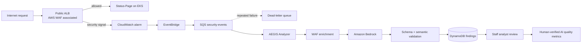
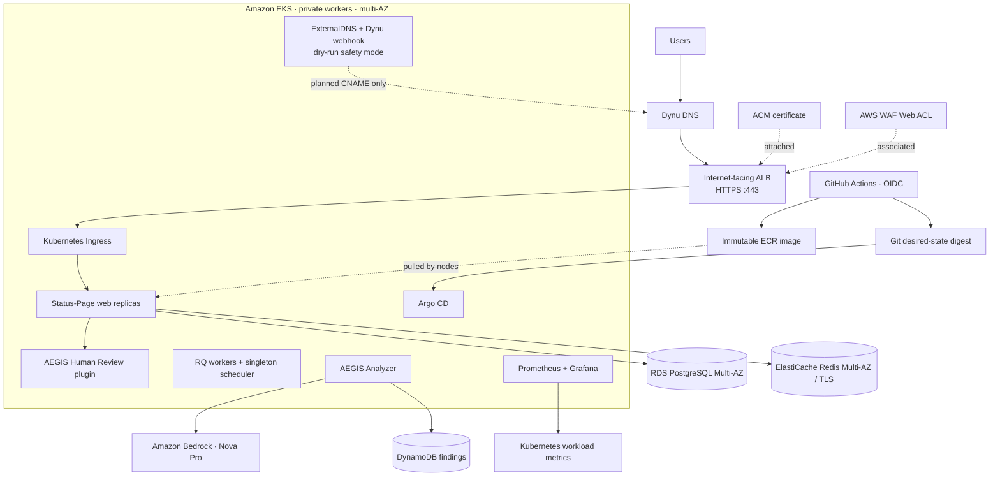

<div align="center">

# AEGIS

### AI-assisted cloud security operations, governed by humans and delivered through GitOps

AEGIS turns AWS edge telemetry into structured, reviewable security findings while operating a hardened Status-Page workload on Amazon EKS.

[](https://github.com/EthicalNayro/AEGIS/actions/workflows/status-page-ci.yml)
[](https://github.com/EthicalNayro/AEGIS/actions/workflows/aegis-ci.yml)
[](https://github.com/EthicalNayro/AEGIS/actions/workflows/terraform-ci.yml)


[Showcase endpoint](https://app.aegis-project.ddnsfree.com) · [Architecture](docs/architecture.md) · [Final acceptance](docs/final-acceptance.md) · [Evidence](docs/evidence.md) · [Diagram set](docs/diagrams/README.md)

</div>

> [!IMPORTANT]
> AEGIS does not perform autonomous remediation. Amazon Bedrock produces advisory findings; an authenticated staff analyst makes the final decision. The analyst console and embedded observability workspace require staff access.

> [!NOTE]
> The accepted showcase state passed the reproducible final gate with **12/12 checks**: repository hygiene, Terraform validation, GitOps render, Argo health, application and ExternalDNS rollouts, DNS safety mode, least-privilege RBAC, immutable digest consistency, multi-AZ placement, and public HTTPS health.

## The project in one minute

AEGIS is a production-style DevSecOps and cloud-security platform built around four connected concerns:

| Plane | What AEGIS implements |
|---|---|
| **Runtime** | Private Amazon EKS workers, multi-AZ Status-Page replicas, RDS PostgreSQL, ElastiCache Redis, health probes, disruption budgets, and Karpenter capacity recovery |
| **Security operations** | AWS WAF telemetry, EventBridge, SQS/DLQ, a Pod Identity-backed analyzer, Amazon Bedrock, DynamoDB findings, and conditional human review |
| **Software delivery** | GitHub OIDC, pinned third-party Actions, container validation, Trivy gates, CycloneDX SBOM, immutable ECR digests, and Argo CD reconciliation |
| **Observability** | Prometheus, Grafana, kube-state-metrics, node metrics, CloudWatch edge signals, and the custom **AEGIS Platform Health** dashboard |

The validated showcase environment is `eks-dev` in `us-east-1`. Its HTTPS endpoint is [app.aegis-project.ddnsfree.com](https://app.aegis-project.ddnsfree.com) while the demonstration environment is active; security operations remain staff-only.

## Analyst experience


<p align="center"><sub>AEGIS over public HTTPS: KPI-driven triage, severity and review-state filters, confidence visualization, and direct case access.</sub></p>

The native Status-Page plugin provides:

- a dark, responsive security command center with operational KPIs;
- searchable and filterable findings with severity, confidence, and review-state signals;
- an incident view that separates AI assessment from raw WAF evidence;
- one-time `CORRECT` / `INCORRECT` analyst verdicts with optional correction and notes;
- conditional DynamoDB updates that prevent accidental double review;
- accessible loading, empty, error, focus, and responsive states;
- a staff-protected observability workspace with embedded Grafana dashboards.

The plugin is isolated under `status-page/statuspage/aegis_review/`. Upstream application logic remains intact; only a limited presentation layer is adapted to create a coherent AEGIS operations experience.

## Visual tour

<table>
  <tr>
    <td width="50%"><br><strong>Public HTTPS edge</strong><br><sub>ACM-backed TLS through the public ALB.</sub></td>
    <td width="50%"><br><strong>WAF enforcement</strong><br><sub>Controlled malicious traffic blocked at the ALB/WAF trust boundary before EKS.</sub></td>
  </tr>
  <tr>
    <td width="50%"><br><strong>AI-assisted classification</strong><br><sub>Bedrock produces structured, advisory security analysis.</sub></td>
    <td width="50%"><br><strong>Measured feedback</strong><br><sub>Human-reviewed outcomes become observable quality signals.</sub></td>
  </tr>
  <tr>
    <td width="50%"><br><strong>GitOps convergence</strong><br><sub>Argo CD reconciles the declared runtime state.</sub></td>
    <td width="50%"><br><strong>Platform observability</strong><br><sub>Live Kubernetes telemetry for the AEGIS namespace.</sub></td>
  </tr>
</table>

The complete validation trail is mapped to project claims in the [evidence index](docs/evidence.md). Evidence filenames are treated as proof only when the corresponding artifact exists under `docs/screenshots/`.

## How a finding becomes a decision



Every trust boundary is deliberate: telemetry is untrusted data, model output is validated, persistence is idempotent, and AI never receives authority to modify infrastructure.

## Architecture



The WAF Web ACL and ACM certificate are attached to the ALB; they are not separate network hops after the load balancer. ExternalDNS remains deliberately non-mutating in the accepted state through `--dry-run`.

### Delivery invariant

```text
source commit
  -> validate + build
  -> Trivy report and fixable-CRITICAL gate
  -> CycloneDX SBOM
  -> immutable ECR digest
  -> guarded GitOps digest update
  -> Argo CD reconciliation
  -> running digest verification
```

GitHub Actions has no EKS deployment permission. CI publishes an immutable artifact and updates declared state; Argo CD owns cluster mutation and self-healing.

## Final architecture set

The repository includes focused Mermaid source diagrams so each view answers one architectural question rather than overloading one poster:

- [High-level platform](docs/diagrams/10-final-platform.mmd)
- [CI/CD + GitOps](docs/diagrams/11-ci-cd-gitops.mmd)
- [Security-event processing](docs/diagrams/12-security-event-pipeline.mmd)
- [Kubernetes HA and workload topology](docs/diagrams/13-kubernetes-ha.mmd)
- [Identity and trust boundaries](docs/diagrams/14-identity-trust.mmd)
- [Observability planes](docs/diagrams/15-observability.mmd)

The older PNG diagrams in `docs/diagrams/` are retained as **Phase 1 historical evidence**, not as the final EKS architecture.

## Platform capabilities

### Cloud and Kubernetes

- VPC `10.10.0.0/16` across two Availability Zones
- isolated public, EKS control-plane, private node/Pod, and private data subnets
- private worker nodes with a Managed Node Group baseline and validated Karpenter recovery
- topology-spread constraints, probes, resource controls, and Pod Disruption Budgets
- `restricted` Pod Security Admission for `aegis-system`
- managed PostgreSQL and Redis outside the cluster

### Security and AI governance

- AWS managed WAF rules, controlled XSS validation, and a dashboard-safe per-IP limit of 500 requests per rolling minute
- EventBridge-driven delivery with SQS buffering and dead-letter protection
- least-privilege EKS Pod Identity with no application AWS keys in source or images
- Amazon Bedrock `amazon.nova-pro-v1:0` with structured-output validation
- human review with conditional, one-time state transitions
- CloudWatch AI-quality metrics that label small samples as `EARLY_SAMPLE`

### Observability

- GitOps-managed `kube-prometheus-stack` in an isolated `monitoring` namespace
- custom **AEGIS Platform Health** dashboard for replicas, workers, scheduler, node readiness, restarts, CPU, memory, availability, and Pod density
- upstream Kubernetes dashboards filtered to the `aegis-system` namespace
- node-exporter protected with `system-cluster-critical` scheduling priority after a validated Pod-density pressure incident
- Grafana kept `ClusterIP`-only with anonymous access disabled
- Django staff authorization enforced before the Nginx Grafana gateway issues a viewer-only identity
- CloudWatch retained for WAF, ALB, event-pipeline, and AI-quality signals

### Supply-chain controls

- short-lived AWS credentials through GitHub OIDC
- branch-scoped trust and an ECR-only CI role
- third-party GitHub Actions pinned to commit SHAs
- immutable tags and digest-pinned Kubernetes deployments
- multi-stage image build and pinned production base image
- Trivy vulnerability/secret scanning and CycloneDX SBOM generation
- stale-workflow protection that fails closed before a GitOps overwrite

## Proof over claims

AEGIS was validated as an end-to-end running system, not only as infrastructure code.

| Validated behavior | Evidence |
|---|---|
| Final acceptance | `AEGIS TECHNICAL VALIDATION: COMPLETE (12 checks passed)` |
| Public TLS path and health endpoint | HTTPS `/healthz` returned `200 ok`; HTTP redirected to HTTPS |
| WAF enforcement | a controlled XSS-like request was blocked with `403` |
| GitOps convergence | both application and observability reached `Synced / Healthy`; desired and runtime image digests matched |
| Safe schema rollout | database migration completed as an Argo CD `PreSync` Job |
| Availability | multiple ready web replicas were placed across Availability Zones |
| Capacity recovery | Karpenter added capacity after Pod pressure and workloads recovered |
| Human governance | a WAF-backed finding received a conditional analyst verdict |
| Platform visibility | Prometheus, Grafana, Kubernetes dashboards, and AEGIS Platform Health were verified |
| DNS automation boundary | ExternalDNS rollout and least-privilege RBAC passed while `--dry-run` remained enabled |
| Supply chain | OIDC authentication, image scan, SBOM, immutable ECR publish, and guarded GitOps update succeeded |

See the [final acceptance proof](docs/final-acceptance.md), complete [validation matrix](docs/validation.md), and [evidence index](docs/evidence.md).

## Repository map

```text
.
├── .github/workflows/             # CI and secure artifact delivery
├── aegis/                         # original CloudTrail processing core
├── ansible/                       # original host automation / Phase 1 history
├── gitops/eks-dev/                # authoritative application desired state
├── kubernetes/
│   ├── argocd/                    # constrained GitOps applications/projects
│   ├── observability/             # Prometheus, Grafana, AEGIS dashboards
│   ├── platform/                  # cluster add-ons and platform resources
│   └── security/                  # analyzer and security-pipeline workloads
├── scripts/                       # validation, review, and AI-quality tooling
├── status-page/                   # application source + isolated AEGIS plugin
├── terraform/
│   ├── environments/dev/          # original EC2 foundation
│   ├── environments/eks-dev/      # final EKS environment
│   └── modules/                   # reusable AWS infrastructure modules
└── docs/                          # architecture, security, operations, evidence
```

`gitops/eks-dev/` is the single source of truth for the production-style Status-Page workload.

## Engineering boundaries

The repository states its boundaries explicitly:

- no autonomous remediation or automatic security-group changes;
- no multi-region EKS or cross-region disaster recovery;
- Argo CD uses the standard non-HA installation;
- Kubernetes NetworkPolicy enforcement is not claimed;
- Status-Page web HPA is not an active production configuration;
- model-quality claims remain preliminary until enough findings are reviewed;
- Dynu ExternalDNS integration remains intentionally in `--dry-run`;
- the project DNS model is appropriate for a showcase environment, not an enterprise DNS platform;
- formal backup-restore exercises and cryptographic image signing remain future hardening work.

## Documentation

| Guide | Purpose |
|---|---|
| [Architecture](docs/architecture.md) | final topology, trust boundaries, runtime, and observability |
| [Networking](docs/networking.md) | current VPC, subnet, traffic, and DNS boundaries |
| [Security](docs/security.md) | identity, secrets, WAF, AI safety, and supply-chain controls |
| [Deployment](docs/deployment.md) | Terraform, CI, immutable delivery, Argo CD, and rollback |
| [Validation](docs/validation.md) | acceptance matrix and reproducible checks |
| [Final acceptance](docs/final-acceptance.md) | exact accepted 12-check runtime proof |
| [Evidence](docs/evidence.md) | claim-to-proof mapping for the final submission |
| [Diagram set](docs/diagrams/README.md) | focused final architecture views and historical diagram labels |
| [Safety enhancements](docs/architecture-safety-enhancements.md) | failure modes and the controls that address them |
| [Architecture decisions](docs/architecture-decisions.md) | implemented design choices and trade-offs |
| [Disaster recovery](docs/disaster-recovery.md) | current recovery posture and unvalidated gaps |
| [Project evolution](docs/phase-1-1-platform-modernization.md) | migration from the original EC2 design to EKS |

## Contributing and security

This is a portfolio/final-project repository, but changes are still expected to preserve production-grade safety. Read [CONTRIBUTING.md](CONTRIBUTING.md) before proposing a change and report sensitive findings through the process in [SECURITY.md](SECURITY.md).

The embedded application is based on the upstream [Status-Page](https://github.com/Status-Page/Status-Page) project. Its license and third-party acknowledgements remain under [`status-page/`](status-page/).

---

<div align="center">
<strong>AEGIS treats infrastructure, delivery, telemetry, AI, human judgment, and resilience as one security system.</strong>
</div>
