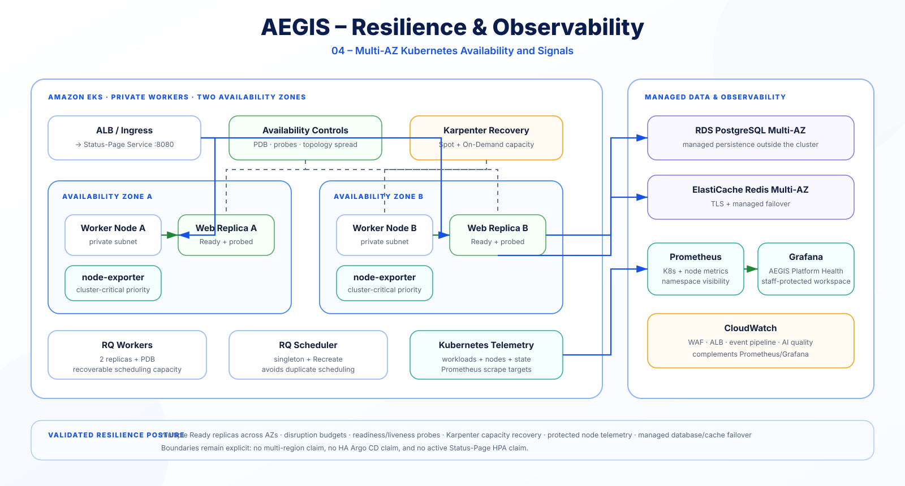

# Architecture

## Scope

AEGIS evolved through two architectural generations:

1. an original EC2/Ansible foundation and CloudTrail processing phase;
2. the validated `eks-dev` modernization, which is the **current showcase architecture**.

The modern platform keeps persistent data outside Kubernetes, uses GitOps for workload delivery, adds WAF-driven security telemetry and AI-assisted analysis, requires human review, and uses Prometheus/Grafana plus CloudWatch as complementary observability planes.

Superseded host-automation and EC2 infrastructure source was retired from the active tree after modernization. Git history and labeled evidence images preserve the earlier phase.

The final accepted state passed [`scripts/final-acceptance.sh`](../scripts/final-acceptance.sh) with **12/12 checks**.

---

## Architecture at a glance

The rendered portfolio diagrams below are the primary visual representation of the final AEGIS architecture. The Mermaid files under [`docs/diagrams/`](diagrams/README.md) remain editable engineering sources, not the primary showcase rendering.

### Final platform architecture


The accepted topology separates the public edge, private Amazon EKS runtime, managed data services, AI/security services, GitOps control plane, and deliberate DNS automation boundary.

### Security signal to human decision


A blocked-request signal is routed through CloudWatch, EventBridge and SQS, analyzed by the AEGIS analyzer with Amazon Bedrock, validated before persistence, and finalized only through protected staff review.

### Secure CI/CD and GitOps


CI validates and publishes an immutable artifact; Git declares the desired digest; Argo CD owns cluster reconciliation. The GitHub CI role has no direct EKS deployment authority.

### Multi-AZ resilience and observability



The runtime uses multiple Ready replicas across Availability Zones with probes, topology spread, disruption budgets, Karpenter recovery capacity, managed data services, and complementary Prometheus/Grafana and CloudWatch observability.

---

## Final Platform Topology

Public traffic resolves through Dynu DNS to an Internet-facing AWS Application Load Balancer on HTTPS `443`. ACM provides the certificate and AWS WAF is associated with the ALB. Traffic is then routed by the ALB-class Kubernetes Ingress to the Status-Page service and private EKS Pods.

AWS WAF and ACM are attached/associated with the ALB. They are **not** modeled as separate serial network appliances after the load balancer.

EKS workers are private. Public exposure is concentrated at the ALB/WAF trust boundary.

### VPC layout

The final environment uses VPC `10.10.0.0/16` across `us-east-1a` and `us-east-1b` with:

- public subnets for the Internet-facing ALB and NAT infrastructure;
- dedicated EKS control-plane subnets;
- private EKS node/Pod subnets;
- private data subnets for RDS and Redis;
- NAT egress per Availability Zone.

See [`networking.md`](networking.md) for the focused networking view.

---

## EKS Runtime

Cluster: `aegis-eks-dev`.

The runtime includes:

- Managed Node Group baseline;
- validated Karpenter scaling with Spot and On-Demand capacity;
- AWS VPC CNI;
- EKS Pod Identity Agent;
- Metrics Server;
- control-plane logging;
- Pod Security Admission in `restricted` mode for `aegis-system`.

Status-Page workloads use non-root execution, dropped capabilities, `RuntimeDefault` seccomp, read-only root filesystems where practical, no privilege escalation, requests/limits, probes, Pod Disruption Budgets, and multi-AZ topology spread.

The web topology rule is revision-aware through `matchLabelKeys: pod-template-hash`, preventing an old rollout revision from falsely satisfying current-revision spread requirements.

---

## Application Runtime

The request path is ALB/Ingress → Service `:8080` → unprivileged Nginx `:8080` → Gunicorn `:8000` → Django / Status-Page. Persistent application state remains outside Kubernetes in managed PostgreSQL and Redis services.

The application runs with two web replicas. Background work uses RQ workers, while the RQ scheduler is a singleton with `Recreate` strategy to avoid overlapping schedulers during rollout.

Database schema migration is separated from application startup. Argo CD runs a dedicated Kubernetes Job as a `PreSync` hook before applying the application revision.

AEGIS security functionality is implemented as a native Status-Page plugin. A limited presentation layer is adapted for the AEGIS operations experience while security/application logic remains isolated from upstream core logic.

---

## Runtime Configuration and Secrets

Sensitive configuration is not committed to Git.

At Pod startup, a renderer combines:

- non-secret runtime configuration;
- a mounted Django `SECRET_KEY`;
- RDS credentials fetched from AWS Secrets Manager through workload identity.

It writes `configuration.py` into a memory-backed runtime volume with restrictive permissions.

Redis uses TLS. RDS credentials are not emitted as plaintext Terraform outputs.

---

## Security Event Architecture

The authoritative security-flow visual is [`21-aegis-security-human-decision.svg`](diagrams/21-aegis-security-human-decision.svg).

The queue decouples detection transport from analysis. Analyzer message visibility is extended while analysis runs, and ACK/delete occurs only after successful persistence. Repeatedly failing messages reach the SQS dead-letter queue only through normal retry exhaustion.

DynamoDB uses `incident_id` as the key, conditional writes for idempotency, encryption, and point-in-time recovery.

### AI trust boundary

Telemetry and model output are treated as untrusted inputs. The analyzer separates instructions from telemetry, requests structured JSON, validates output before persistence, and stores a reviewable finding rather than taking autonomous action.

AI remains advisory.

---

## Human Review and AI Quality

The native AEGIS plugin exposes staff-only analyst views for DynamoDB findings.

A reviewer can mark a finding `CORRECT` or `INCORRECT`, optionally supply a corrected classification, and add a note. Updates are conditional on the item still being in `PENDING_REVIEW` state.

A separate metrics script publishes human-verified quality statistics to the `AEGIS/AIQuality` CloudWatch namespace.

Small samples are labeled `EARLY_SAMPLE`. This is measured human feedback, not reinforcement learning and not automatic retraining.

---

## CI/CD and GitOps Architecture

The authoritative delivery visual is [`22-aegis-secure-cicd-gitops.svg`](diagrams/22-aegis-secure-cicd-gitops.svg).

GitHub authenticates to AWS through OIDC. The Status-Page CI role can deliver to ECR but has no EKS deployment permission.

Argo CD is the Kubernetes CD authority. `AppProject` boundaries constrain sources, destinations, and resource kinds. Automated sync, pruning, self-heal, `PruneLast`, `ApplyOutOfSyncOnly`, and server-side apply enforce declared state.

The CI workflow refreshes the remote branch before preparing desired state. Newer non-GitOps source causes a stale workflow to fail closed. CI uploads a focused promotion artifact and never bypasses `main`; the digest reaches Argo CD only through a protected pull request.

Terraform CI is validation-only and checks the authoritative `terraform/environments/eks-dev` environment; the repository does not claim an automated approval-gated Terraform apply workflow.

---

## Observability Architecture

The authoritative resilience and observability visual is [`23-aegis-resilience-observability.svg`](diagrams/23-aegis-resilience-observability.svg).

AEGIS uses two complementary observability planes.

### Kubernetes and workload telemetry

The GitOps-managed `aegis-observability` application deploys `kube-prometheus-stack` into `monitoring` and includes:

- Prometheus;
- Grafana;
- kube-state-metrics;
- node-exporter;
- Git-provisioned AEGIS Platform Health dashboard.

The custom dashboard covers application/analyzer/RQ/scheduler availability, node readiness, restarts, CPU, memory, deployment availability, and Pod-density pressure.

During final validation, one node-exporter Pod remained Pending because its target node reached the Pod-density limit. The final values harden node-level telemetry with:

```yaml
prometheus-node-exporter:
  priorityClassName: system-cluster-critical
```

After reconciliation, `aegis-observability` returned to `Synced / Healthy` and the final gate passed.

Grafana remains `ClusterIP`-only with anonymous access disabled. Staff authorization is enforced before the same-origin AEGIS gateway issues a viewer-only Grafana identity.

### AWS edge and security telemetry

CloudWatch remains authoritative for:

- WAF allowed/blocked traffic and rate limiting;
- ALB request/4XX/5XX/latency signals;
- security-event pipeline alarms;
- AI-quality metrics.

Prometheus/Grafana and CloudWatch therefore complement rather than duplicate each other.

---

## DNS Automation Boundary

The implemented public DNS provider is Dynu for `app.aegis-project.ddnsfree.com`.

Route 53 is not part of the implemented architecture.

The repository includes ExternalDNS v0.21 plus an AEGIS Dynu webhook provider with:

- namespace-scoped Ingress read access;
- exact Ingress label and hostname filters;
- CNAME-only handling;
- `upsert-only` policy;
- allowed `.elb.amazonaws.com` target suffix;
- delete refusal;
- API credential supplied through a Kubernetes Secret;
- `--dry-run` enabled.

The final 12-check acceptance gate proved the ExternalDNS rollout, Argo health, least-privilege RBAC, and dry-run safety state.

AEGIS does **not** claim active automated Dynu mutation in the accepted state.

---

## Engineering Diagram Sources

The rendered SVGs are the primary portfolio views. Detailed editable Mermaid sources remain under [`docs/diagrams/`](diagrams/README.md):

1. `10-final-platform.mmd` — high-level platform;
2. `11-ci-cd-gitops.mmd` — software delivery;
3. `12-security-event-pipeline.mmd` — security processing;
4. `13-kubernetes-ha.mmd` — workload topology / resilience;
5. `14-identity-trust.mmd` — IAM and trust boundaries;
6. `15-observability.mmd` — Kubernetes and AWS observability planes.

The Mermaid files are engineering sources and should not be used as the primary recruiter-facing rendering when an authoritative SVG exists.

---

## Historical Architecture Boundary

The active source tree retains only the EKS-oriented implementation. The superseded EC2 environment and Ansible roles remain auditable in Git history, while labeled screenshots and diagrams preserve project-evolution evidence.

The authoritative final application desired state is under `gitops/eks-dev/`.

Historical EC2 documents/diagrams must not be used to describe the current runtime.

---

## Architecture Boundaries

The final project does not claim:

- autonomous remediation;
- reinforcement learning or automatic retraining;
- multi-region EKS;
- Kubernetes NetworkPolicy enforcement;
- HA Argo CD;
- Status-Page web HPA as active production configuration;
- cryptographically signed images;
- live automated Dynu writes while ExternalDNS remains in `--dry-run`;
- enterprise-grade DNS;
- formally exercised end-to-end disaster recovery.

These are explicit boundaries rather than hidden gaps.
