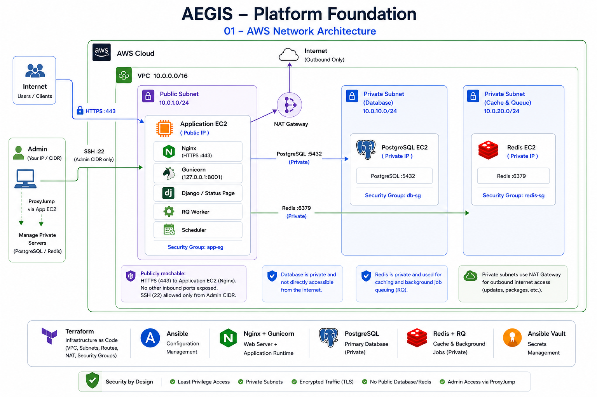
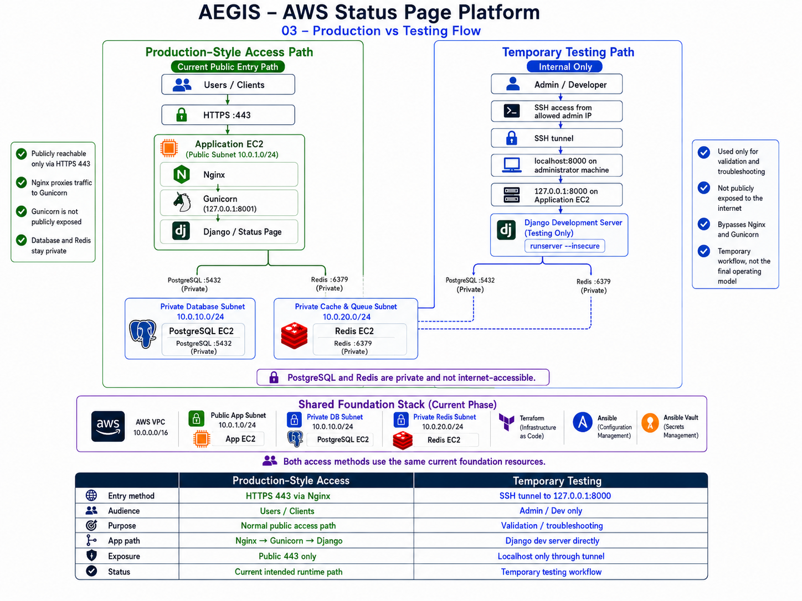

# Architecture

## Scope

This document describes **Phase 1 — AEGIS Platform Foundation**, the currently deployed AWS and application baseline. It does not describe the future AEGIS detection, agent, or remediation layers.

## Current Architecture



The foundation uses three Ubuntu 22.04 EC2 instances inside one VPC:

- **Application EC2** in a public subnet
- **PostgreSQL EC2** in a private database subnet
- **Redis EC2** in a private Redis subnet

The application host is the only Internet-facing compute instance. PostgreSQL and Redis do not receive public IP addresses.

## Network Layout

```text
VPC 10.0.0.0/16

├── Public Application Subnet 10.0.1.0/24
│   ├── Application EC2
│   └── NAT Gateway
│
├── Private Database Subnet 10.0.10.0/24
│   └── PostgreSQL EC2
│
└── Private Redis Subnet 10.0.20.0/24
    └── Redis EC2
```

The public subnet uses an Internet Gateway. Both private subnets use the shared private route table and NAT Gateway for outbound Internet access required for package installation and updates.

## Application Runtime

Production request flow:

```text
Client
  -> HTTPS :443
Nginx
  -> 127.0.0.1:8001
Gunicorn
  -> Django
Django
  -> PostgreSQL :5432
  -> Redis :6379
```

Background processing runs on the application EC2 instance:

```text
Django / Scheduler
        |
        v
      Redis
        |
        v
    RQ Worker
```

## Administration Path

SSH access to the public application host is restricted to the configured administrator CIDR. The private PostgreSQL and Redis hosts are reached using SSH ProxyJump through the application host.

```text
Administrator
   |
   | SSH :22
   v
Application EC2
   |
   | ProxyJump
   +------> PostgreSQL EC2
   `------> Redis EC2
```

## Production vs Testing



The Django development server is not publicly exposed. When needed, it binds to `127.0.0.1:8000` on the same application host and is reached through an SSH local port forward.

```text
Developer Browser
  -> localhost:8000
SSH Tunnel
  -> aegis-app:127.0.0.1:8000
Django runserver
```

Production and testing therefore share the same foundation resources but use different access paths.

## Infrastructure Ownership

Terraform owns AWS infrastructure state. Ansible owns host and application configuration.

The active Terraform environment currently calls the `vpc`, `security_groups`, and `ec2` modules. The `iam` and `vpc_endpoints` modules remain in the repository as inactive/future hardening work and are not part of the deployed architecture.
