# Deployment

## Overview

Phase 1 deployment is intentionally operator-driven. GitHub stores the code and runs Terraform CI validation, while actual infrastructure and configuration changes are applied manually from the administrator workstation.

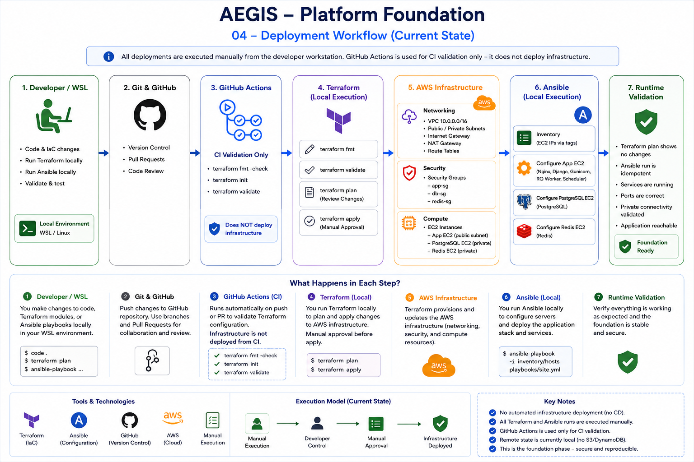

```text
Developer / WSL
      |
      +------> GitHub
      |          |
      |          `--> GitHub Actions: fmt / init / validate only
      |
      v
Terraform
      |
      v
AWS Infrastructure
      |
      v
Ansible
      |
      +--> Application EC2
      +--> PostgreSQL EC2
      `--> Redis EC2
```

## Prerequisites

- Terraform 1.15.8
- AWS CLI
- Ansible
- Git
- SSH key pair used by the Terraform EC2 module
- AWS credentials/profile with the required project permissions
- `community.postgresql` Ansible collection

The local toolchain used for the foundation was verified before deployment:

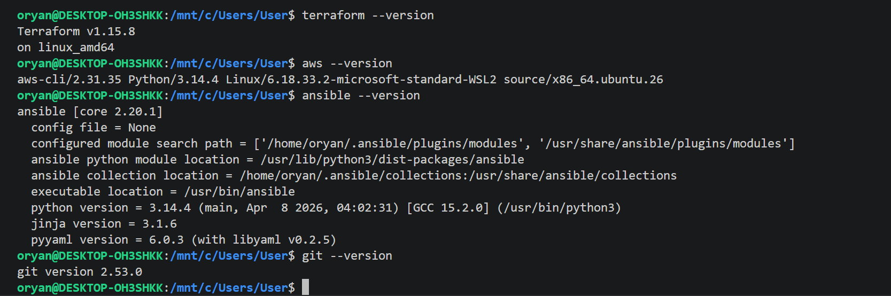

Install Ansible collection requirements:

```bash
cd ansible
ansible-galaxy collection install -r requirements.yml
```

## Terraform Deployment

From the dev environment:

```bash
cd terraform/environments/dev
export AWS_PROFILE=aegis-project
terraform init
terraform fmt -check
terraform validate
terraform plan
terraform apply
```

Terraform initialization completed successfully with the pinned AWS provider:

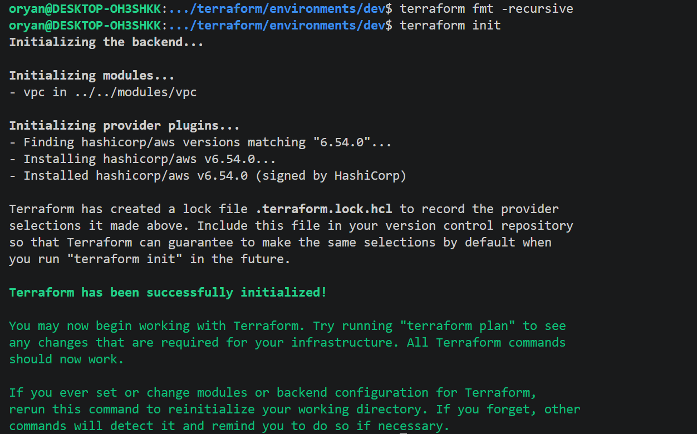

The initial network plan showed the expected foundation resources before apply:

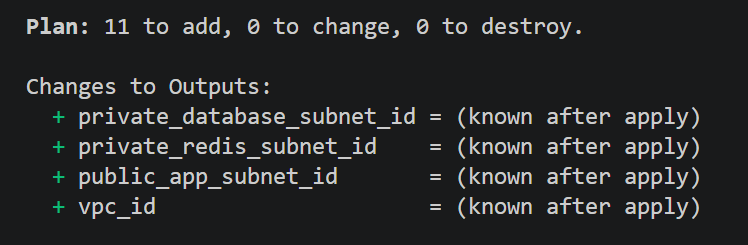

The first network foundation apply completed successfully:

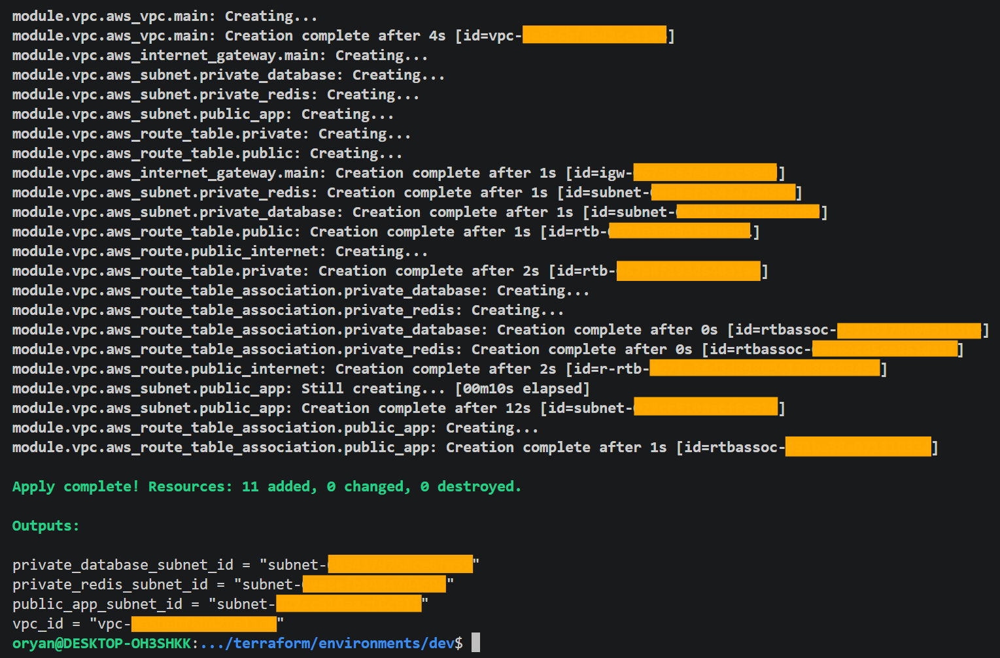

`terraform.tfvars` is local and ignored by Git. `terraform.tfvars.example` documents the expected input shape without storing local secrets or state.

The active dev composition provisions:

- VPC and DNS settings
- Internet Gateway
- Public application subnet
- Private PostgreSQL subnet
- Private Redis subnet
- Public and private route tables
- NAT Gateway and Elastic IP
- Application, database and Redis Security Groups
- Three EC2 instances and the project SSH key pair

Private-subnet outbound connectivity through the NAT Gateway was validated before package installation:

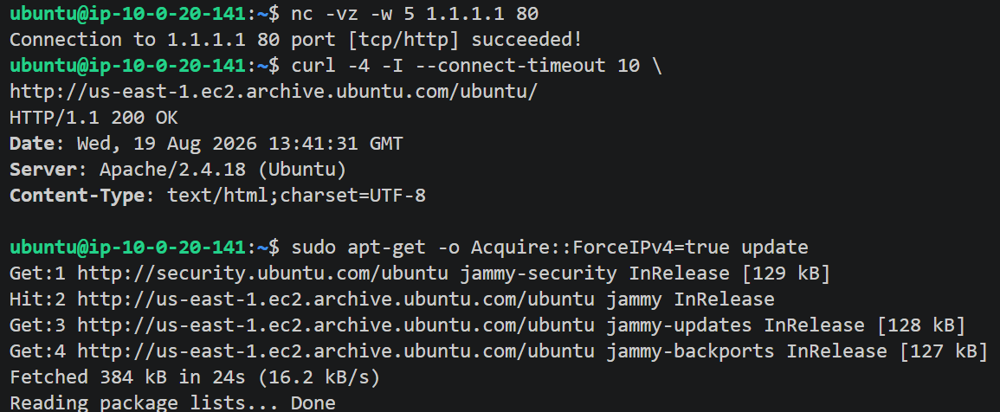

## SSH Administration

The administrator connects directly to the application host and uses ProxyJump for the private hosts.

Example SSH aliases:

```text
Host aegis-app
  -> public application EC2

Host aegis-database
  -> private PostgreSQL EC2 via aegis-app

Host aegis-redis
  -> private Redis EC2 via aegis-app
```

## Ansible Deployment

From the `ansible/` directory:

```bash
export ANSIBLE_CONFIG="$(pwd)/ansible.cfg"
ansible-playbook playbooks/site.yml --ask-vault-pass
```

Before applying roles, Ansible connectivity to all three hosts was verified:

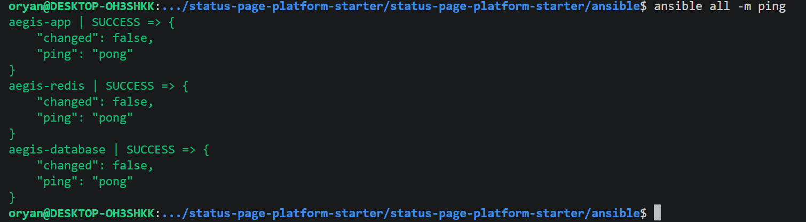

The playbook applies:

- `common`, `status_page`, `gunicorn`, `nginx` to the application host
- `common`, `postgres` to the database host
- `common`, `redis` to the Redis host

### PostgreSQL

The PostgreSQL role configures private network access and restricts the application database to the application host:

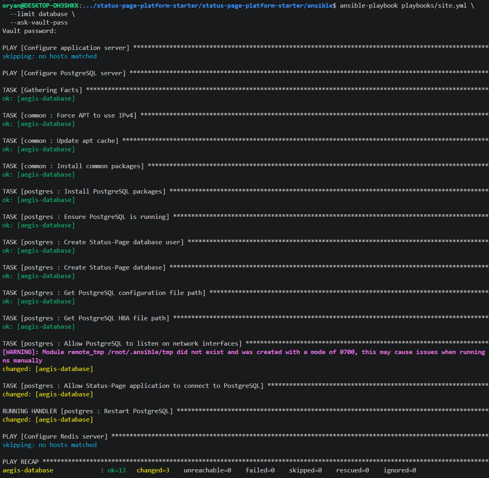

The `statuspage` database and application role were verified after configuration:

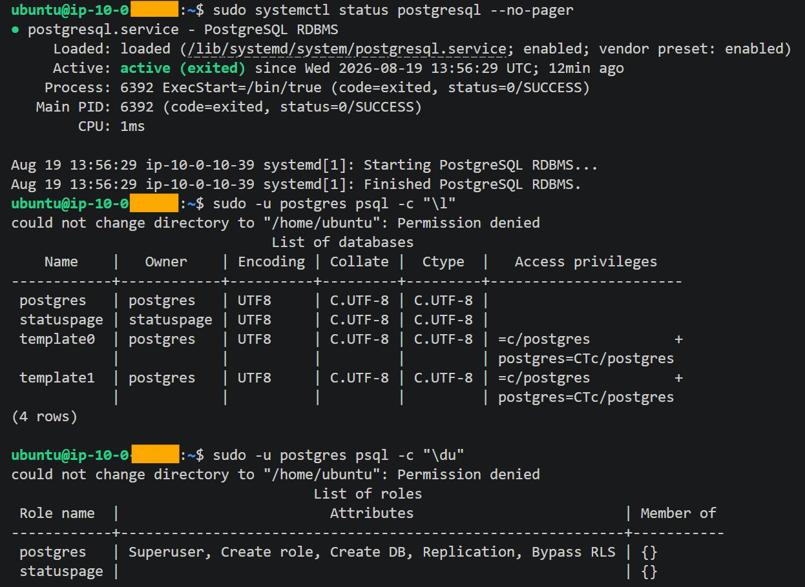

### Redis

The Redis role installs and configures Redis on the private host:

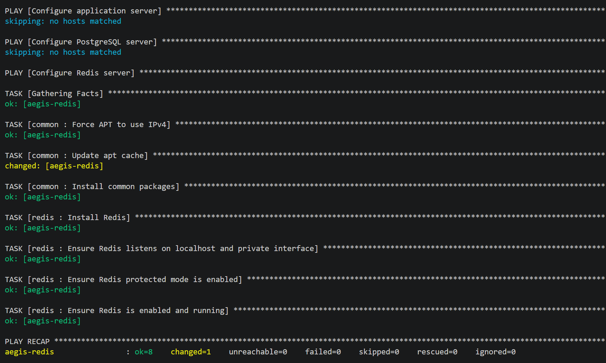

Redis service health, `PONG`, and private-interface listener state were verified:

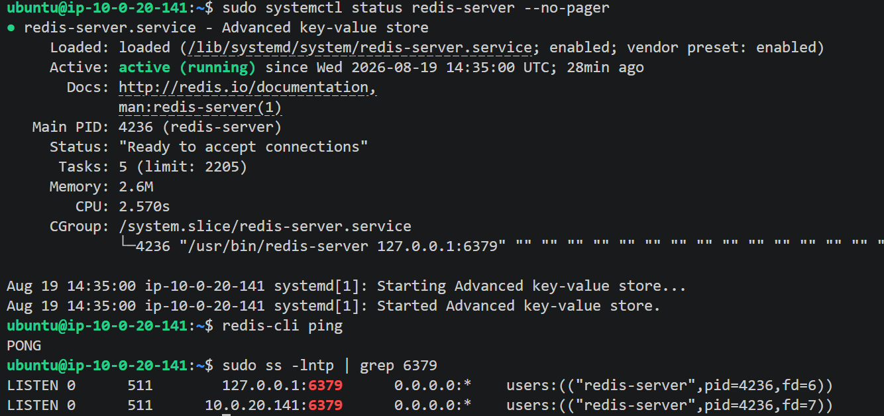

### Status Page Application

The application role installs dependencies, configures the service account and application, and prepares the Status Page runtime:

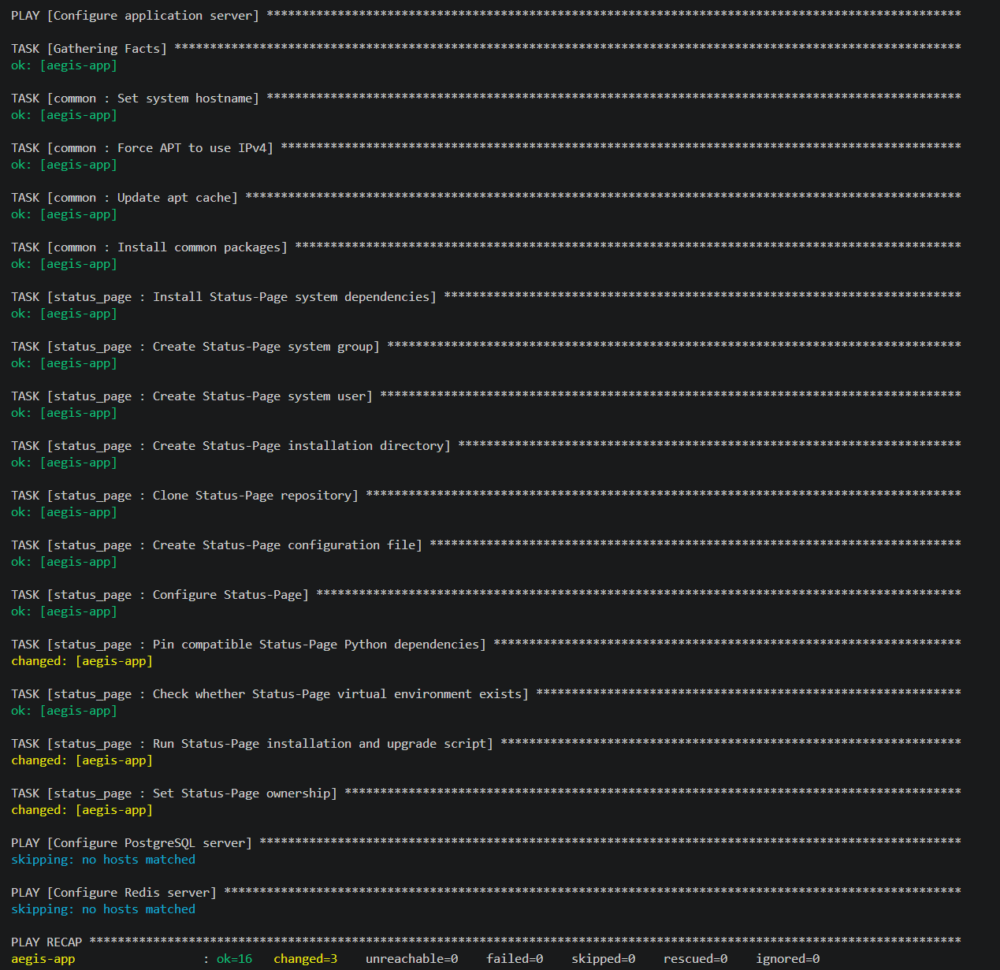

## Production Runtime

The application host runs:

```text
nginx
status-page
status-page-rq
status-page-scheduler
```

The systemd services were verified as active:

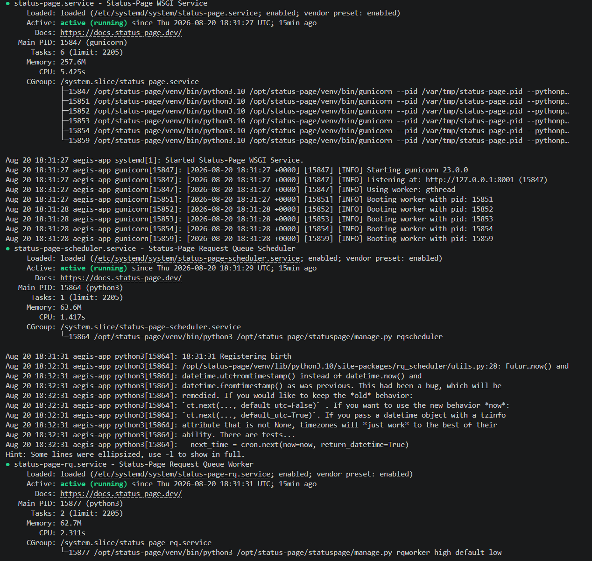

Nginx and the temporary self-signed TLS certificate are configured by Ansible:

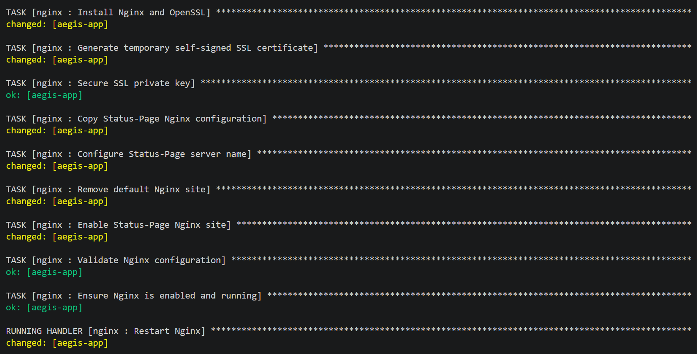

The complete local production chain was then verified: Nginx on `443`, Gunicorn on `127.0.0.1:8001`, and a successful HTTPS response through Nginx:

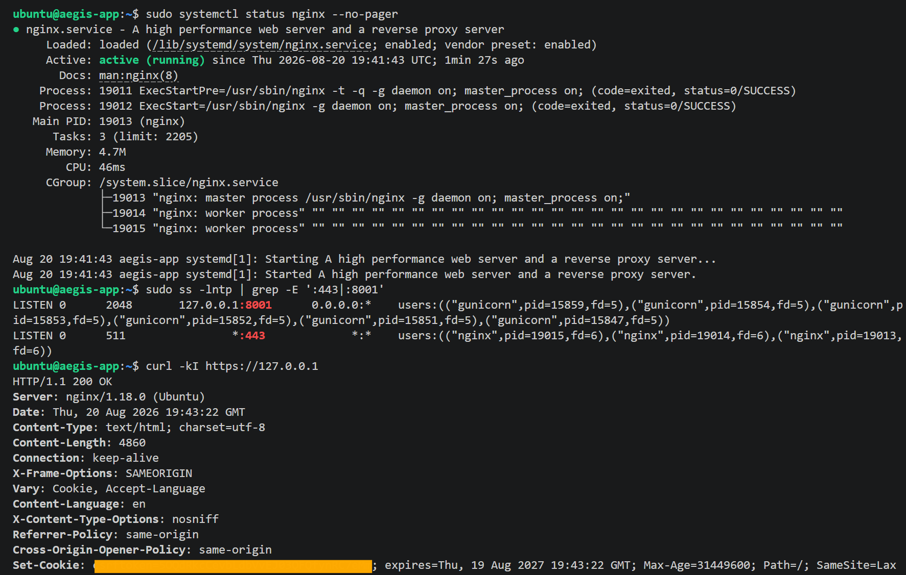

## Testing Runtime

For temporary development-server testing:

```bash
sudo -u status-page bash -c '
cd /opt/status-page &&
/opt/status-page/venv/bin/python statuspage/manage.py \
  runserver 127.0.0.1:8000 --insecure --noreload
'
```

From the developer workstation:

```bash
ssh -L 8000:127.0.0.1:8000 aegis-app
```

Then browse to `http://localhost:8000`.

The testing path is validated separately in [Validation](validation.md) because it must remain private and must not reopen TCP `8000` to the Internet.

## GitHub Actions Scope

The repository contains a basic CI workflow that runs on pushes to `main` and pull requests. It performs:

```text
terraform fmt -check
terraform init -backend=false
terraform validate
```

It does not run `terraform apply`, Ansible, or application deployment. Continuous deployment is future work.
