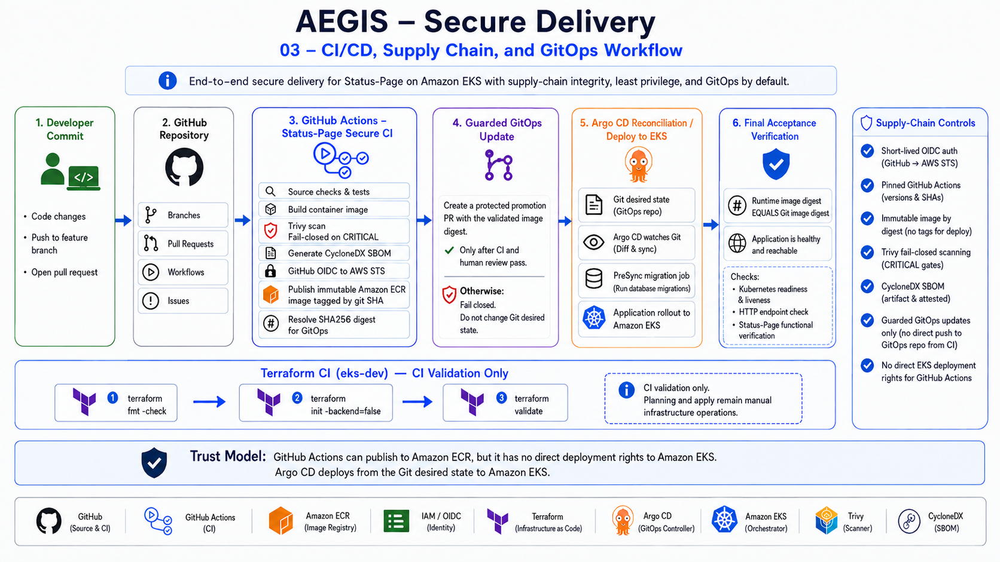
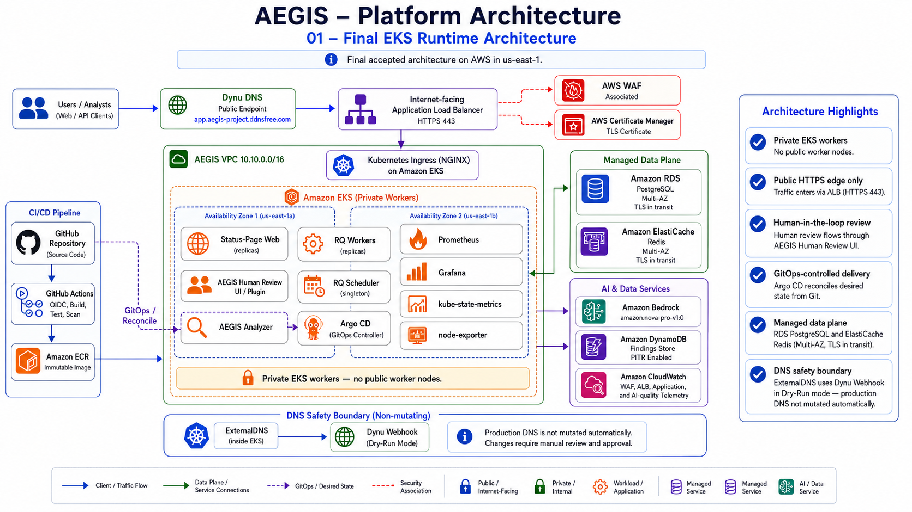
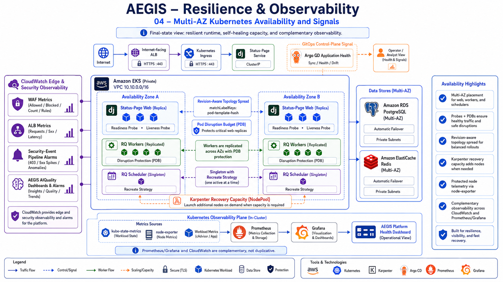

# Deployment

## Overview

The final AEGIS delivery model separates **infrastructure validation**, **application CI**, and **Kubernetes CD**.



GitHub Actions does not deploy the Status-Page directly with `kubectl` and the Status-Page CI role has no EKS deployment permission. Argo CD continuously reconciles Kubernetes state from reviewed Git desired state.

The diagram is the authoritative portfolio-facing delivery view.

---

## Environment

Final showcase environment:

```text
AWS region: us-east-1
Terraform environment: terraform/environments/eks-dev
EKS cluster: aegis-eks-dev
Kubernetes namespace: aegis-system
GitOps path: gitops/eks-dev
Deployment branch: main
```

The active tree contains only the supported EKS-oriented deployment.

---

## Infrastructure Provisioning Boundary

Terraform owns the AWS infrastructure for `eks-dev`, including the VPC/EKS foundation, managed data services, ECR, WAF/observability resources, event queues, DynamoDB findings storage, and workload IAM roles.

The repository CI validates the authoritative Terraform environment at `terraform/environments/eks-dev`.

The workflow runs formatting, `init -backend=false`, and validation using pinned third-party GitHub Actions.

The repository does **not** claim an implemented approval-gated Terraform apply workflow, remote-state disaster-recovery design, or automatic infrastructure deployment from the application CI path.

Infrastructure apply remains an explicit operational activity separate from Status-Page delivery.

---

## Status-Page Container Build

The Status-Page image uses a multi-stage Docker build.

The builder stage contains compilation/build tooling and produces the Python virtual environment. The runtime stage starts again from the pinned Python base-image digest and installs only runtime OS dependencies before copying the virtual environment and application.

This keeps compiler/development packages out of the final runtime image.

The application source is based on a pinned upstream Status-Page revision and includes the native AEGIS review plugin plus limited intentional UI/template overrides.

---

## GitHub Actions CI

All active third-party GitHub Actions are pinned by exact commit SHA.

The secure Status-Page workflow performs two major jobs.

### Validate & Build

- checks out the exact repository revision;
- verifies required build inputs;
- validates AEGIS plugin Python;
- validates the runtime configuration renderer;
- builds the container;
- runs a Trivy vulnerability/secret report;
- enforces a fail-closed CRITICAL vulnerability gate.

### Publish Immutable Image

- authenticates to AWS using GitHub OIDC;
- verifies AWS identity;
- logs in to ECR;
- derives an immutable image tag from the Git commit;
- reuses an existing exact image on safe reruns, otherwise builds it;
- runs the production-image Trivy gate;
- generates a CycloneDX SBOM;
- uploads SBOM evidence;
- pushes the image to ECR when required;
- resolves the immutable ECR digest;
- safely synchronizes the GitOps branch;
- updates the GitOps image digest;
- packages the desired-state change as a promotion artifact for a protected pull request.

---

## GitHub OIDC

CI uses short-lived AWS credentials from GitHub's OIDC token rather than repository access keys.

The GitHub workflow receives an OIDC token, exchanges it through AWS STS, and assumes the branch-scoped AEGIS GitHub CI IAM role. The role can deliver to ECR but cannot deploy directly to EKS and cannot pass arbitrary IAM roles.

---

## Immutable Delivery

The deployment uses ECR image digests rather than mutable runtime tags.

A build starts from the immutable Git-derived image tag, resolves the resulting ECR `sha256` digest, and promotes that digest into `gitops/eks-dev/kustomization.yaml`. Argo CD therefore deploys the exact artifact declared in Git.

The final acceptance gate compares the GitOps digest with all application-image uses in the live Status-Page Deployment:

- Gunicorn;
- `render-configuration` init container;
- `collect-static` init container.

---

## Safe GitOps Synchronization

A workflow can become stale while it is building. AEGIS protects against that race before preparing a desired-state promotion.

Before updating `gitops/eks-dev/kustomization.yaml`, CI fetches the current remote branch and inspects commits newer than the workflow source revision.

- If the only newer change is the previous GitOps digest update, a safe rerun can continue.
- If newer non-GitOps source exists, the workflow fails closed.

This protection was exercised by a real workflow run: a stale delivery was rejected after newer source advanced the branch.

The delivery job never bypasses `main` branch protection. When the resolved digest differs from Git, CI uploads the updated `kustomization.yaml` and a focused patch as a release artifact. The immutable digest is promoted through a pull request; only after that reviewed Git change lands can Argo CD reconcile it to EKS.

---

## Argo CD Continuous Delivery

Argo CD watches the deployment branch and `gitops/eks-dev` path.

The Application enables:

- automated sync;
- pruning;
- self-heal;
- `CreateNamespace=false`;
- `PruneLast`;
- `ApplyOutOfSyncOnly`;
- server-side apply.

The AppProject restricts source, destination, and allowed resource kinds.

`gitops/eks-dev/` is the sole authoritative production-style desired state; no competing workload source-of-truth is maintained.

The final acceptance gate requires both `aegis-status-page` and `aegis-observability` to reach `Synced / Healthy`.

---

## Database Migration

Django migrations execute through a dedicated Kubernetes Job annotated as an Argo CD `PreSync` hook.

Argo CD applies the reviewed Git desired state, runs the migration Job first, waits for `Django migrate --noinput` to succeed, and only then continues the application rollout.

The Job uses the same immutable application image and workload security boundaries as the application.

This avoids every web replica racing to perform schema migration during startup.

---

## Runtime Workloads

The GitOps composition includes:

- Status-Page web Deployment;
- ClusterIP Service on `8080`;
- Pod Disruption Budget;
- Status-Page service account;
- RQ worker Deployment and PDB;
- singleton RQ scheduler;
- Ingress for the public ALB;
- unprivileged Nginx configuration;
- runtime configuration renderer;
- migration Job;
- ExternalDNS controller + Dynu webhook in dry-run safety mode.

Sensitive runtime Secrets are intentionally not stored in the public repository.

---

## Public Traffic



The production request path redirects HTTP `:80` to HTTPS and serves public traffic through the Internet-facing ALB on `:443`. ACM provides TLS and AWS WAF is associated with the ALB. The ALB-class Kubernetes Ingress routes traffic to Service `:8080`, then to unprivileged Nginx, Gunicorn, and Django on private EKS workers.

ACM and WAF are relationships on the ALB; they are not modeled as serial hops after it.

Health endpoint:

```text
https://app.aegis-project.ddnsfree.com/healthz
```

Accepted response:

```text
HTTP 200
ok
```

---

## DNS Automation

The public hostname is managed by Dynu:

```text
app.aegis-project.ddnsfree.com
```

ExternalDNS v0.21 is deployed with an AEGIS Dynu webhook provider. The accepted state intentionally keeps `--dry-run` enabled.

The final gate verifies the ExternalDNS rollout and least-privilege RBAC while ensuring dry-run remains enabled. Active automated Dynu mutation is not claimed.

---

## Observability Rollout Note



During final observability validation, one node-exporter Pod could not schedule because its target node reached the Pod-density limit. The GitOps values were hardened with `system-cluster-critical` priority for node-exporter. After reconciliation, the observability Argo application returned to `Synced / Healthy`.

This incident is recorded because it demonstrates the deployment model behaving correctly under scheduling pressure rather than hiding a partially rolled-out DaemonSet.

---

## Final Acceptance

From repository root:

```bash
bash scripts/final-acceptance.sh
```

Accepted result:

```text
AEGIS TECHNICAL VALIDATION: COMPLETE (12 checks passed)
```

See [`final-acceptance.md`](final-acceptance.md) for the complete proof.

---

## Rollback Model

Because the deployed artifact is identified by digest in Git, application rollback is an auditable Git operation: restore a previously validated digest in desired state and allow Argo CD to reconcile.

Application deployment is therefore reproducible independently of a developer workstation.
