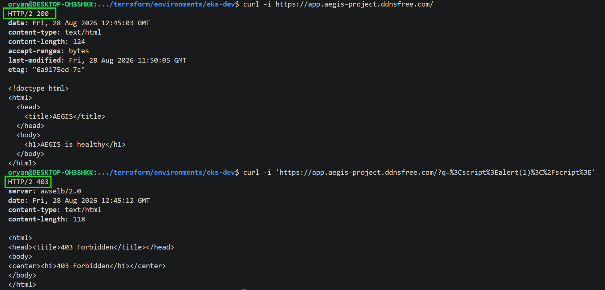
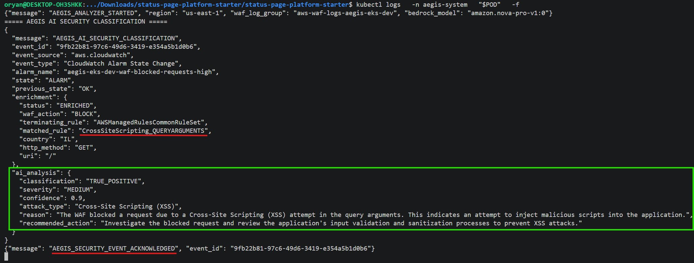
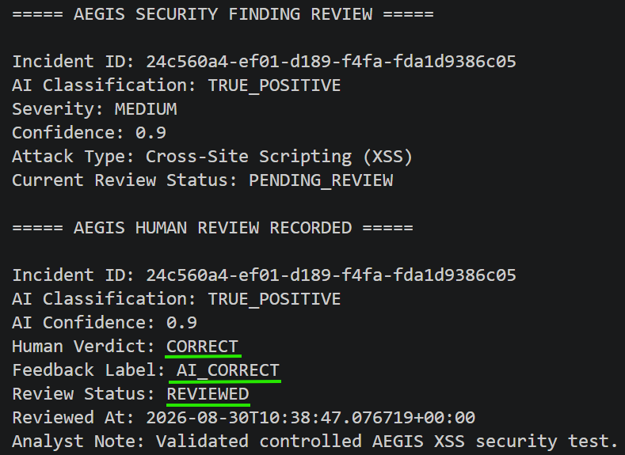
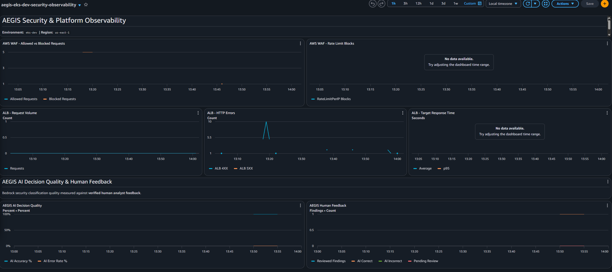
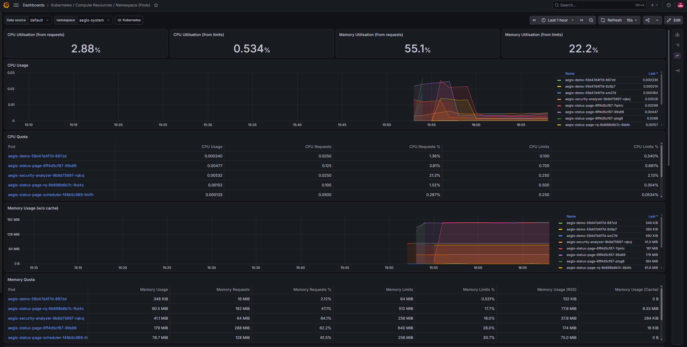

# Evidence Index

This index maps AEGIS claims to captured or reproducible proof. It deliberately distinguishes **runtime validation**, **captured screenshots**, and **presentation evidence still waiting to be copied into the repository**.

A filename in this document is not itself proof. Screenshot evidence is considered captured only when the corresponding file exists under `docs/screenshots/`.

---

## Final Acceptance

The accepted final gate is:

```bash
bash scripts/final-acceptance.sh
```

Validated result:

```text
AEGIS TECHNICAL VALIDATION: COMPLETE (12 checks passed)
```

The exact 12 checks and their scope are recorded in [`final-acceptance.md`](final-acceptance.md).

This means the **runtime is technically accepted**. Any screenshot marked pending below is an evidence-packaging task, not an unresolved runtime blocker.

---

## Platform / GitOps Milestones

| Evidence | Status | What it proves |
|---|---|---|
| [`83-aegis-argocd-gitops-synced-healthy.png`](screenshots/83-aegis-argocd-gitops-synced-healthy.png) | ✅ captured | Argo CD reached `Synced / Healthy` during the application milestone |
| `84` drift/self-heal evidence | ✅ validated | Argo CD reconciled runtime drift back to Git desired state |
| [`85-aegis-secure-ci-oidc-ecr-gitops.png`](screenshots/85-aegis-secure-ci-oidc-ecr-gitops.png) | ✅ captured | OIDC, ECR delivery, security gates, and GitOps digest update |
| [`86-aegis-argocd-presync-database-migration.png`](screenshots/86-aegis-argocd-presync-database-migration.png) | ✅ captured | database migration succeeded as Argo CD `PreSync` |
| [`87-aegis-sbom-idempotent-ci-rerun.png`](screenshots/87-aegis-sbom-idempotent-ci-rerun.png) | ✅ captured | CycloneDX SBOM and safe/idempotent CI rerun behavior |
| [`88-aegis-multistage-runtime-hardening.png`](screenshots/88-aegis-multistage-runtime-hardening.png) | ✅ captured | multi-stage runtime image and healthy rollout |
| [`89-aegis-final-gitops-runtime-verification.png`](screenshots/89-aegis-final-gitops-runtime-verification.png) | ✅ captured | GitOps/runtime acceptance captured before the observability and DNS checks were added |
| [`90-aegis-prometheus-grafana-gitops-synced.png`](screenshots/90-aegis-prometheus-grafana-gitops-synced.png) | ✅ captured | observability application reached GitOps `Synced / Healthy` |
| [`91-aegis-grafana-kubernetes-observability.png`](screenshots/91-aegis-grafana-kubernetes-observability.png) | ✅ captured | live Kubernetes telemetry for `aegis-system` |
| `92-aegis-grafana-platform-health-dashboard.png` | ⏳ file copy pending | final corrected AEGIS Platform Health dashboard |
| `93-aegis-externaldns-dynu-dry-run.png` | ⏳ screenshot capture/copy pending | ExternalDNS/Dynu dry-run proof; runtime checks already passed |
| [`94-aegis-security-command-center.png`](screenshots/94-aegis-security-command-center.png) | ✅ captured | deployed analyst command center and case navigation |
| `95-aegis-final-acceptance-12-checks.png` | ⏳ screenshot copy pending | the successful final `12/12` acceptance output |

---

## Final Runtime Proof

The accepted final sequence verifies:

```text
Git desired state
   |
   v
Argo CD: application + observability Synced / Healthy
   |
   v
Status-Page + ExternalDNS rollouts complete
   |
   +--> ExternalDNS stays --dry-run
   +--> least-privilege RBAC proven
   |
   v
GitOps sha256 digest == all Status-Page application-image digests
   |
   v
Multiple Ready replicas across Availability Zones
   |
   v
Public HTTPS /healthz -> 200 ok
```

The final acceptance script checks the immutable digest used by:

- `gunicorn`;
- `render-configuration` init container;
- `collect-static` init container.

This is stronger than comparing only one container field.

---

## Secure CI / Supply Chain

Validated CI behavior includes:

```text
source validation
 -> container build
 -> Trivy report + fail-closed CRITICAL gate
 -> GitHub OIDC authentication
 -> immutable ECR delivery
 -> production-image validation
 -> CycloneDX SBOM
 -> immutable digest resolution
 -> guarded GitOps update
 -> Argo reconciliation
```

A stale workflow was prevented from overwriting newer desired state, proving that the GitOps race guard fails closed. Safe reruns also reuse the exact existing immutable commit image.

Third-party GitHub Actions are pinned by commit SHA across the active CI workflows. Terraform CI validates both the original `dev` environment and the final `eks-dev` environment.

---

## Availability / Resilience Proof

Validated behavior includes:

- multiple Ready Status-Page replicas;
- placement across separate Availability Zones;
- revision-aware topology spread;
- readiness/liveness probes;
- Pod Disruption Budgets;
- RDS Multi-AZ;
- Redis Multi-AZ and automatic failover;
- Karpenter capacity recovery;
- HPA scaling on the dedicated demo workload.

Status-Page web HPA is **not** claimed as active.

During final observability validation, a node-exporter Pod could not schedule because its target node hit the Pod-density limit. The hardening response was committed to GitOps:

```yaml
prometheus-node-exporter:
  priorityClassName: system-cluster-critical
```

After reconciliation, the observability application returned to `Synced / Healthy` and the final gate passed. This is evidence of an observed failure mode leading to an explicit resilience control.

---

## Public Edge / WAF Proof

Validated edge behavior includes:

| Test | Observed result |
|---|---|
| HTTP request | redirected to HTTPS |
| normal HTTPS request | application response succeeded |
| `/healthz` | `HTTP 200` with `ok` body |
| controlled XSS-style query | blocked by AWS WAF |
| WAF blocked-request threshold | CloudWatch alarm transition observed |

The AWS WAF Web ACL is associated with the ALB. Diagrams should model it as an ALB protection boundary, not as a separate network appliance hop after the load balancer.



---

## Security Event / AI Proof

The validated active path is:

```text
WAF BlockedRequests
 -> CloudWatch Alarm
 -> EventBridge
 -> SQS
 -> Analyzer
 -> WAF enrichment
 -> Amazon Bedrock Nova Pro
 -> structured JSON validation
 -> conditional DynamoDB persistence
 -> SQS ACK after persistence
```

The analyzer uses dedicated workload identity. Telemetry/model output are treated as untrusted inputs and AI has no infrastructure mutation authority.



---

## Human Review Proof

The review workflow demonstrates:

- staff-protected access;
- DynamoDB finding retrieval;
- conditional transition from `PENDING_REVIEW`;
- `CORRECT` / `INCORRECT` analyst verdicts;
- optional correction and analyst note;
- protection against accidental double review.



---

## AI Quality Proof

Human-reviewed findings feed metrics published under:

```text
AEGIS/AIQuality
```

Small sample sizes are labeled `EARLY_SAMPLE`; AEGIS does not claim reinforcement learning or automatic model retraining.



---

## Observability Proof

Prometheus/Grafana validation demonstrated:

- dedicated `aegis-observability` Argo CD application;
- Prometheus, Grafana, kube-state-metrics, and node-exporter;
- live namespace/workload/Pod/node telemetry;
- Git-provisioned AEGIS Platform Health dashboard;
- corrected availability and Pod-density semantics;
- Grafana `ClusterIP`-only with anonymous access disabled;
- staff-controlled same-origin embedding.

CloudWatch remains complementary for WAF, ALB, event-pipeline, alarms, and AI-quality metrics.



---

## ExternalDNS / Dynu Proof

The final acceptance gate validated the ExternalDNS Deployment rollout, Argo application health, least-privilege Kubernetes RBAC, and continued `--dry-run` safety mode.

The implementation additionally enforces:

- exact Ingress label and hostname filtering;
- CNAME-only record handling;
- `upsert-only` policy;
- allowed `.elb.amazonaws.com` target suffix;
- delete refusal;
- Dynu API credential from a Kubernetes Secret, never Git.

This is an **installed and runtime-validated dry-run integration**. It is not evidence that automated Dynu writes are active.

Screenshot 93 is still useful presentation evidence and should show the exact intended hostname without exposing the API key.

---

## Repository / Source-of-Truth Proof

Repository validation covers:

- Terraform source for the authoritative `eks-dev` environment;
- Kubernetes/GitOps source;
- analyzer and human-review tooling;
- Status-Page plugin/UI source;
- observability and ExternalDNS source;
- pinned CI Actions;
- no tracked Terraform state/plan/editor artifacts;
- credentials excluded from Git;
- generated local scratch artifacts ignored.

`gitops/eks-dev/` is the authoritative production-style Status-Page desired state.
