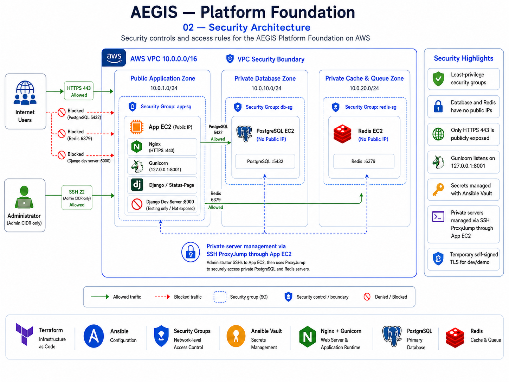

# Security

## Security Model

Phase 1 applies a simple principle: expose only what the current application needs, keep the data tier private, and separate development access from production traffic.



## Network Controls

### Public Application Entry Point

The application security group allows:

- HTTPS `443` from the Internet
- SSH `22` only from the configured administrator CIDR

Django development port `8000` is not exposed publicly, and Gunicorn listens only on `127.0.0.1:8001`.

### Private PostgreSQL

The PostgreSQL instance has no public IP. Its security group accepts:

- PostgreSQL `5432` only from the application security group
- SSH `22` only from the application security group

### Private Redis

The Redis instance has no public IP. Its security group accepts:

- Redis `6379` only from the application security group
- SSH `22` only from the application security group

## Administrative Access

The application EC2 instance acts as the SSH jump point for the private hosts.

```text
Administrator
   -> SSH :22 from allowed CIDR
Application EC2
   -> ProxyJump
PostgreSQL / Redis
```

The private key remains on the administrator workstation and is not copied to the application server.

## Secrets

Application-sensitive values are stored in an encrypted Ansible Vault file rather than plaintext inventory variables.

Protected values include the Status Page database password and Django `SECRET_KEY`.

Terraform local variable files and state files are excluded from Git through `.gitignore`.

## EC2 Hardening

All three EC2 instances are configured with:

- Encrypted gp3 root volumes
- IMDSv2 token requirement
- Ubuntu 22.04 from the Canonical AMI owner

## TLS

Nginx terminates HTTPS on port `443` and proxies requests to Gunicorn on localhost.

The current dev foundation uses a self-signed certificate. This provides TLS encryption but does not provide browser trust from a public certificate authority. A trusted certificate and custom domain are future hardening work.

## Current-State Boundaries

The following are **not currently active controls** and must not be represented as deployed architecture:

- AWS Systems Manager private host management
- SSM / SSMMessages VPC Interface Endpoints
- AgentCore policies
- AEGIS automated remediation

The repository contains inactive Terraform scaffolding for some future IAM/PrivateLink work, but the deployed Phase 1 management path is SSH ProxyJump.
