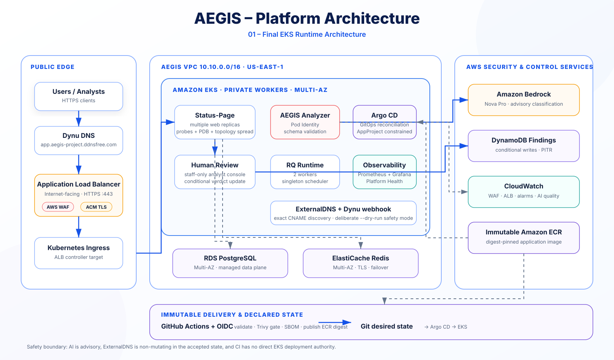
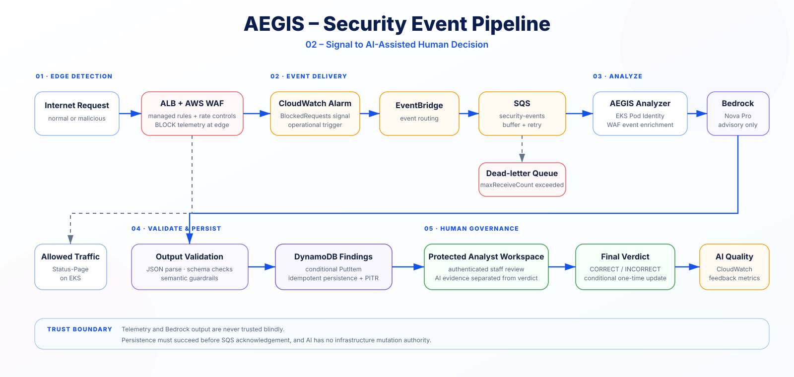
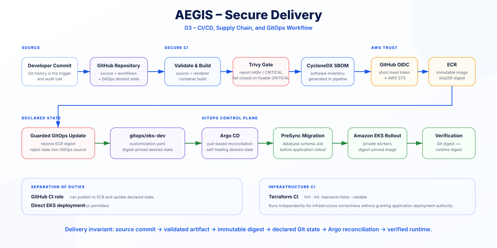

# Security

## Security Model

AEGIS uses defense in depth across network boundaries, workload identity, software delivery, application runtime, security telemetry, DNS automation, and AI governance.

The final platform intentionally minimizes direct trust relationships. Public traffic terminates at the ALB/WAF boundary, Kubernetes workers remain private, managed data services are private, CI does not receive cluster deployment access, and AI output is never treated as authoritative without validation and human review.

### Security architecture at a glance

The rendered SVGs are the portfolio-facing security architecture. Editable Mermaid files under [`docs/diagrams/`](diagrams/README.md) remain engineering sources only.

---

## Internet Edge

The public path is Dynu DNS → Internet-facing ALB on HTTPS `443` → ALB-class Kubernetes Ingress → Status-Page Service `:8080` → private EKS Pods.

ACM provides the TLS certificate and AWS WAF is associated with the ALB. ACM and WAF are security/control-plane relationships on the edge resource, not serial network appliances after the load balancer.

Controls include:

- ACM-managed TLS certificate;
- HTTP-to-HTTPS redirect;
- AWS WAF managed rule groups;
- Amazon IP reputation filtering;
- known-bad-input protections;
- per-IP rate limiting;
- WAF BLOCK logging to CloudWatch Logs.

A controlled XSS-style query proved WAF enforcement and returned HTTP `403`.

---

## Private Compute and Data

EKS worker nodes and application Pods run in private subnets without public IPs.

RDS PostgreSQL and ElastiCache Redis are private and are not exposed directly to the Internet.

RDS uses encryption, automated backups, Multi-AZ deployment, and deletion protection. Redis uses encryption at rest, TLS in transit, Multi-AZ replication, automatic failover, and snapshots.

---

## Kubernetes Workload Security

The `aegis-system` namespace uses Pod Security Admission in `restricted` mode.

Workloads apply controls such as:

- explicit non-root user/group IDs;
- `allowPrivilegeEscalation: false`;
- `RuntimeDefault` seccomp;
- dropped Linux capabilities;
- read-only root filesystems where practical;
- explicit CPU/memory requests and limits;
- readiness and liveness probes;
- Pod Disruption Budgets;
- topology spread across Availability Zones;
- service-account token automount disabled where not required.

The unprivileged Nginx sidecar listens on port `8080` rather than requiring privileged port binding.

The ExternalDNS controller is also hardened with a fixed non-root identity and only receives a manually projected Kubernetes API token in the controller container; the Dynu webhook sidecar does not receive that token.

---

## AWS Workload Identity

AEGIS uses EKS Pod Identity for AWS access from Kubernetes workloads.

Examples include:

- the security analyzer role scoped to its namespace and service account;
- the Status-Page runtime/reviewer role scoped to the Status-Page service account;
- the AWS Load Balancer Controller identity.

The analyzer receives only the permissions required for the security pipeline. The Status-Page runtime can read the exact managed RDS secret and DynamoDB finding data required by the review UI; it does not receive SQS or Bedrock permissions.

No long-lived application AWS access keys are stored in the repository or application image.

For the detailed identity/trust engineering source, see [`diagrams/14-identity-trust.mmd`](diagrams/14-identity-trust.mmd).

---

## Secrets and Runtime Configuration

Sensitive values are not stored in Git.

The runtime configuration renderer reads managed secret material at startup and writes the final Django configuration to an in-memory volume with restrictive file permissions.

Controls include:

- RDS master credentials managed by AWS Secrets Manager;
- Django `SECRET_KEY` supplied through a Kubernetes Secret created outside the public repository;
- Dynu API credential supplied through a Kubernetes Secret and never committed;
- no plaintext Terraform output for RDS credentials;
- repository ignore rules for Terraform state, local variable files, editor artifacts, keys, environment files, and identified local static-generation scratch artifacts.

---

## Software Supply-Chain Security

The active CI workflows use third-party GitHub Actions pinned by exact commit SHA.

The Status-Page delivery workflow includes:

- GitHub OIDC authentication to AWS;
- exact branch-scoped IAM trust;
- ECR-only CI permissions and no EKS deployment access;
- pinned Python base-image digest;
- multi-stage image build;
- immutable ECR tags;
- Kubernetes deployment by digest;
- Trivy vulnerability/secret scanning;
- fail-closed fixable-CRITICAL gate;
- CycloneDX SBOM generation and artifact retention;
- concurrency controls;
- idempotent image reuse on safe reruns;
- fail-closed GitOps synchronization when a workflow is stale;
- protected pull-request promotion for every desired-state digest change.

The stale-workflow protection was validated in practice: an older delivery run was refused after newer non-GitOps source advanced the branch, preventing stale desired state from overwriting newer source.

Terraform CI validates the authoritative `eks-dev` environment. It validates infrastructure code; the repository does not claim an automated approval-gated Terraform apply workflow.

---

## GitOps Security Boundary

GitHub Actions is CI, not the Kubernetes deployment authority. CI can publish the immutable artifact and prepare a protected GitOps promotion, but Argo CD is the component that reconciles reviewed Git desired state into EKS.

The Argo CD Application is constrained by an AppProject with explicit source, destination, and resource-kind boundaries. Automated sync uses self-heal and pruning so drift is reconciled back to reviewed Git state.

Database migrations execute as a dedicated `PreSync` Job, keeping schema mutation separate from steady-state application startup.

The final acceptance gate additionally verifies that the GitOps image digest matches the live application-image digests used by Gunicorn and both application init containers.

---

## ExternalDNS / Dynu Security Boundary

The accepted ExternalDNS integration is intentionally non-mutating through `--dry-run`.

The Kubernetes/controller boundary enforces:

- namespace-scoped Ingress read access;
- no Secret list permission;
- no Ingress delete permission;
- exact AEGIS Ingress label filtering;
- exact hostname filtering.

The Dynu webhook additionally enforces:

- CNAME-only handling;
- `upsert-only` behavior;
- exact hostname ownership;
- target suffix restricted to `.elb.amazonaws.com`;
- bounded TTL validation;
- delete refusal;
- API key never logged and never stored in Git.

The final 12-check acceptance run proved the controller rollout, least-privilege RBAC, Argo health, and continued dry-run state. AEGIS does not claim active automated Dynu writes.

---

## Security Event Pipeline

The authoritative event-processing visual is [`21-aegis-security-human-decision.svg`](diagrams/21-aegis-security-human-decision.svg).

The active WAF-driven path uses CloudWatch Alarm → EventBridge → SQS → AEGIS Analyzer → Amazon Bedrock → validated DynamoDB finding → protected human review.

SQS buffers events between production and analysis. A DLQ captures repeatedly failing events after normal retry exhaustion.

The analyzer acknowledges a message only after persistence succeeds. DynamoDB conditional writes make processing idempotent when an event is replayed.

---

## AI Security and Governance

Telemetry can contain attacker-controlled strings and is treated as untrusted data.

AEGIS therefore:

- separates system instructions from telemetry;
- does not permit telemetry to redefine the analyzer task;
- requests structured JSON from Bedrock;
- parses and validates model output before persistence;
- does not automatically execute remediation from model output;
- requires human analyst review for trust decisions;
- measures quality from reviewed findings instead of assuming model correctness.

The AI layer is advisory and governed, not autonomous.

---

## Human Review Separation

The review workflow supports `CORRECT` and `INCORRECT` verdicts, optional corrected classification, and analyst notes.

Updates are conditional on `PENDING_REVIEW`, preventing silent overwrite of an already-reviewed finding.

The current Status-Page IAM role acts as both runtime and reviewer identity because the application also needs the managed RDS secret. A future production refinement would split those duties into separate identities.

---

## Current Security Boundaries

The following are intentionally **not** claimed as active controls:

- autonomous remediation;
- Kubernetes NetworkPolicy enforcement;
- multi-region active/active architecture;
- HA Argo CD;
- cryptographic container signing/attestation;
- active automated Dynu mutation;
- production-scale reviewer identity separation;
- formal end-to-end backup/restore validation.

These remain future hardening opportunities rather than undocumented assumptions.
