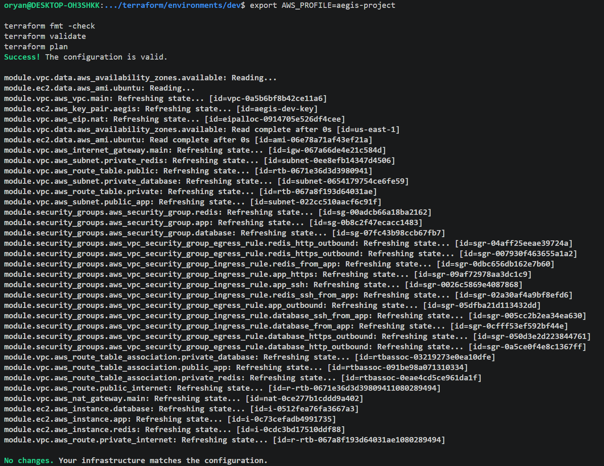
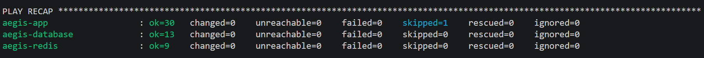
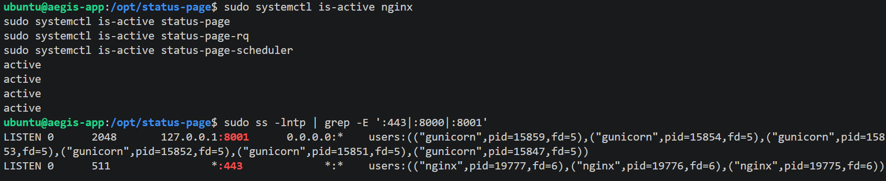
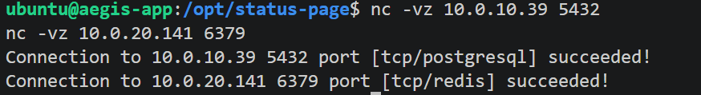
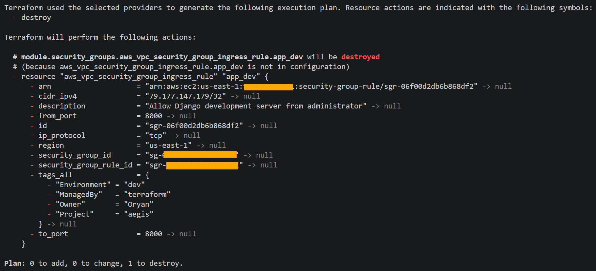
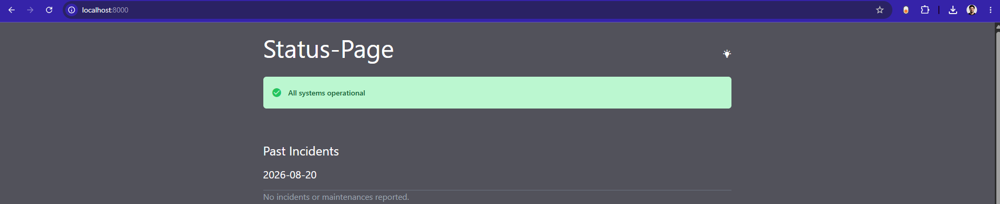
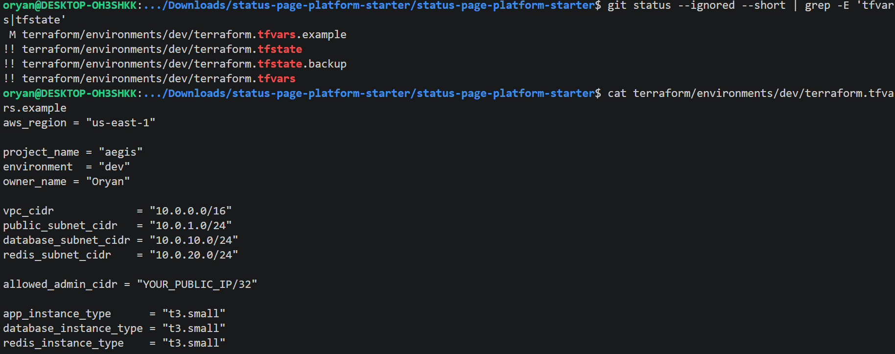
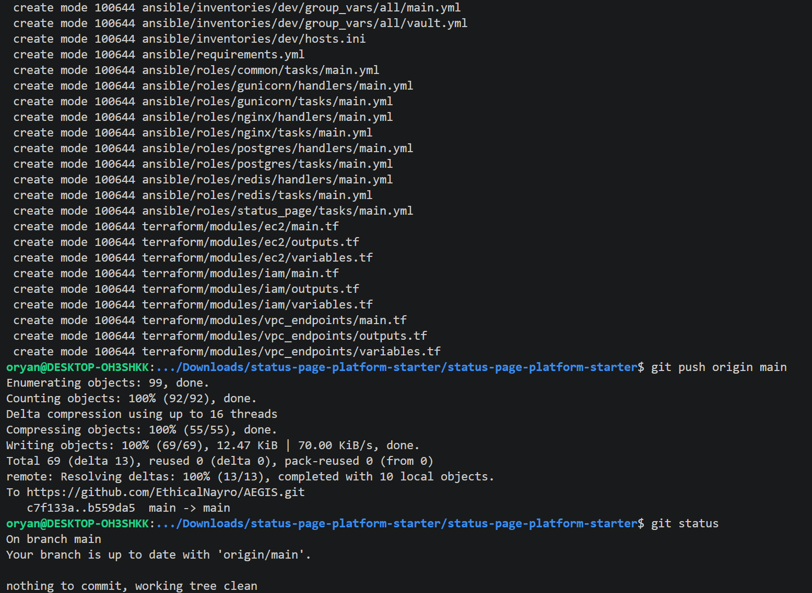

# Validation

## Goal

Validation confirms that the Phase 1 foundation is reproducible, reachable only through the intended paths, and stable across repeated Terraform and Ansible runs.

## Terraform Validation

From `terraform/environments/dev`:

```bash
terraform fmt -check
terraform validate
terraform plan
```

Expected final state:

```text
No changes. Your infrastructure matches the configuration.
```

This verifies that the deployed AWS resources match the current Terraform configuration.



## Ansible Idempotency

From `ansible/`:

```bash
export ANSIBLE_CONFIG="$(pwd)/ansible.cfg"
ansible-playbook playbooks/site.yml --ask-vault-pass
```

Repeated execution should leave already-correct configuration unchanged except for legitimate maintenance tasks such as an expired APT cache refresh.



## Service Health

On the application EC2 instance:

```bash
sudo systemctl is-active nginx
sudo systemctl is-active status-page
sudo systemctl is-active status-page-rq
sudo systemctl is-active status-page-scheduler
```

Expected result:

```text
active
active
active
active
```

## Listening Ports

```bash
sudo ss -lntp | grep -E ':443|:8000|:8001'
```

Expected production state:

```text
:443                Nginx
127.0.0.1:8001      Gunicorn
:8000                no production listener
```

Port `8000` is used only when the temporary development server is explicitly started.

The final runtime check verifies service health and the expected production listeners:



## Private Backend Connectivity

From the application host:

```bash
nc -vz 10.0.10.39 5432
nc -vz 10.0.20.141 6379
```

Both checks should succeed.



## Production Request Path

Verify the HTTPS application endpoint through Nginx. In the current dev environment the browser will warn about the self-signed certificate; that warning is expected.

The intended path is:

```text
HTTPS :443 -> Nginx -> Gunicorn :8001 -> Django
```

## Private Testing Path

The public Django development ingress rule was removed from Terraform before final validation:



Start Django on `127.0.0.1:8000`, then create a local SSH tunnel:

```bash
ssh -L 8000:127.0.0.1:8000 aegis-app
```

The application should be reachable at:

```text
http://localhost:8000
```

The private testing path was verified through the local SSH tunnel:



Direct Internet access to the application host on TCP `8000` should fail.

## Git Hygiene

Before committing documentation or infrastructure changes:

```bash
git diff --check
git status
git check-ignore -v \
  terraform/environments/dev/terraform.tfvars \
  terraform/environments/dev/terraform.tfstate \
  terraform/environments/dev/terraform.tfstate.backup
```

The local `.tfvars` file and Terraform state must remain ignored. The encrypted Ansible Vault file may be committed only in its encrypted `$ANSIBLE_VAULT` form.

The ignore rules were explicitly verified:



The final repository state was also checked to confirm a clean working tree:


